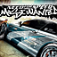
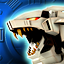

# List of games with optimized settings (447 games currently)

<h3>This repo is a port of A1eNaz's <a href="https://github.com/A1eNaz/Xenia-Game-Settings/wiki">Wiki of optimized settings</a></h3>

<table id="games-table" align="center"><thead><tr><th></th><th>Title Id</th><th>Title</th><th>Last Modified</th></tr></thead><tbody><tr><td></td><td>
<a href="https://github.com/xenia-manager/Optimized-Settings/blob/main/Settings/454107E6.json"><strong>454107E6</strong></a>
</td><td>
<strong>2006 FIFA World Cup</strong>
</td><td>
<a href="https://github.com/xenia-manager/Optimized-Settings/commit/5566f3fe97c6eb7b821c3b423feac15069eb78b0">20/01/2025</a>
</td></tr><tr><td></td><td>
<a href="https://github.com/xenia-manager/Optimized-Settings/blob/main/Settings/454108E4.json"><strong>454108E4</strong></a>
</td><td>
<strong>2010 FIFA World Cup South Africa</strong>
</td><td>
<a href="https://github.com/xenia-manager/Optimized-Settings/commit/b797d776c8d9332b1bbeb89cf330bdc45938f0ec">27/03/2025</a>
</td></tr><tr><td></td><td>
<a href="https://github.com/xenia-manager/Optimized-Settings/blob/main/Settings/454109D4.json"><strong>454109D4</strong></a>
</td><td>
<strong>2014 FIFA World Cup Brazil</strong>
</td><td>
<a href="https://github.com/xenia-manager/Optimized-Settings/commit/b797d776c8d9332b1bbeb89cf330bdc45938f0ec">27/03/2025</a>
</td></tr><tr><td></td><td>
<a href="https://github.com/xenia-manager/Optimized-Settings/blob/main/Settings/5451083B.json"><strong>5451083B</strong></a>
</td><td>
<strong>50 Cent: Blood on the Sand</strong>
</td><td>
<a href="https://github.com/xenia-manager/Optimized-Settings/commit/58f72da425047877340b1f7e8662f5c4fd5695cc">24/05/2025</a>
</td></tr><tr><td></td><td>
<a href="https://github.com/xenia-manager/Optimized-Settings/blob/main/Settings/4E4D07D1.json"><strong>4E4D07D1</strong></a>
</td><td>
<strong>ACE COMBAT 6 Fires of Liberation</strong>
</td><td>
<a href="https://github.com/xenia-manager/Optimized-Settings/commit/97239d12c4c836b2e4672c1badddb951921813df">29/12/2024</a>
</td></tr><tr><td></td><td>
<a href="https://github.com/xenia-manager/Optimized-Settings/blob/main/Settings/4D530805.json"><strong>4D530805</strong></a>
</td><td>
<strong>Alan Wake</strong>
</td><td>
<a href="https://github.com/xenia-manager/Optimized-Settings/commit/b8c7a7927a547500f9373bcfa94109fd4494463c">24/05/2025</a>
</td></tr><tr><td></td><td>
<a href="https://github.com/xenia-manager/Optimized-Settings/blob/main/Settings/58410A22.json"><strong>58410A22</strong></a>
</td><td>
<strong>Alien Breed 2: Assault</strong>
</td><td>
<a href="https://github.com/xenia-manager/Optimized-Settings/commit/b8c7a7927a547500f9373bcfa94109fd4494463c">24/05/2025</a>
</td></tr><tr><td></td><td>
<a href="https://github.com/xenia-manager/Optimized-Settings/blob/main/Settings/58410964.json"><strong>58410964</strong></a>
</td><td>
<strong>Alien Breed Episode 1</strong>
</td><td>
<a href="https://github.com/xenia-manager/Optimized-Settings/commit/b8c7a7927a547500f9373bcfa94109fd4494463c">24/05/2025</a>
</td></tr><tr><td></td><td>
<a href="https://github.com/xenia-manager/Optimized-Settings/blob/main/Settings/5345080C.json"><strong>5345080C</strong></a>
</td><td>
<strong>Aliens: Colonial Marines</strong>
</td><td>
<a href="https://github.com/xenia-manager/Optimized-Settings/commit/9890cf96a8dc4c0f5e2ae4a2b82f9599bfeea3a5">01/01/2025</a>
</td></tr><tr><td></td><td>
<a href="https://github.com/xenia-manager/Optimized-Settings/blob/main/Settings/55530808.json"><strong>55530808</strong></a>
</td><td>
<strong>America's Army: True Soldiers</strong>
</td><td>
<a href="https://github.com/xenia-manager/Optimized-Settings/commit/4c4b92e290f8d963c2d241294766d459e20c36d1">30/12/2024</a>
</td></tr><tr><td></td><td>
<a href="https://github.com/xenia-manager/Optimized-Settings/blob/main/Settings/4156088B.json"><strong>4156088B</strong></a>
</td><td>
<strong>Apache: Air Assault</strong>
</td><td>
<a href="https://github.com/xenia-manager/Optimized-Settings/commit/5566f3fe97c6eb7b821c3b423feac15069eb78b0">20/01/2025</a>
</td></tr><tr><td></td><td>
<a href="https://github.com/xenia-manager/Optimized-Settings/blob/main/Settings/4E4D0864.json"><strong>4E4D0864</strong></a>
</td><td>
<strong>Armored Core: Verdict Day</strong>
</td><td>
<a href="https://github.com/xenia-manager/Optimized-Settings/commit/5566f3fe97c6eb7b821c3b423feac15069eb78b0">20/01/2025</a>
</td></tr><tr><td></td><td>
<a href="https://github.com/xenia-manager/Optimized-Settings/blob/main/Settings/454107F8.json"><strong>454107F8</strong></a>
</td><td>
<strong>Army of Two</strong>
</td><td>
<a href="https://github.com/xenia-manager/Optimized-Settings/commit/b8c7a7927a547500f9373bcfa94109fd4494463c">24/05/2025</a>
</td></tr><tr><td></td><td>
<a href="https://github.com/xenia-manager/Optimized-Settings/blob/main/Settings/454108D8.json"><strong>454108D8</strong></a>
</td><td>
<strong>Army of Two: The 40th Day</strong>
</td><td>
<a href="https://github.com/xenia-manager/Optimized-Settings/commit/940c6f439319c2556ec122b136c6c1bb9c763b2e">11/12/2024</a>
</td></tr><tr><td></td><td>
<a href="https://github.com/xenia-manager/Optimized-Settings/blob/main/Settings/555307D4.json"><strong>555307D4</strong></a>
</td><td>
<strong>Assassin's Creed</strong>
</td><td>
<a href="https://github.com/xenia-manager/Optimized-Settings/commit/f79e284840881b77b9c0da7783fbab63a7054ea5">21/01/2025</a>
</td></tr><tr><td></td><td>
<a href="https://github.com/xenia-manager/Optimized-Settings/blob/main/Settings/5553083B.json"><strong>5553083B</strong></a>
</td><td>
<strong>Assassin's Creed II</strong>
</td><td>
<a href="https://github.com/xenia-manager/Optimized-Settings/commit/f79e284840881b77b9c0da7783fbab63a7054ea5">21/01/2025</a>
</td></tr><tr><td></td><td>
<a href="https://github.com/xenia-manager/Optimized-Settings/blob/main/Settings/555308AE.json"><strong>555308AE</strong></a>
</td><td>
<strong>Assassin's Creed III</strong>
</td><td>
<a href="https://github.com/xenia-manager/Optimized-Settings/commit/32d4d25a52e691867adb347d9961cd03d35d7c38">01/01/2025</a>
</td></tr><tr><td></td><td>
<a href="https://github.com/xenia-manager/Optimized-Settings/blob/main/Settings/555308C2.json"><strong>555308C2</strong></a>
</td><td>
<strong>Assassin's Creed IV: Black Flag</strong>
</td><td>
<a href="https://github.com/xenia-manager/Optimized-Settings/commit/32d4d25a52e691867adb347d9961cd03d35d7c38">01/01/2025</a>
</td></tr><tr><td></td><td>
<a href="https://github.com/xenia-manager/Optimized-Settings/blob/main/Settings/555308CE.json"><strong>555308CE</strong></a>
</td><td>
<strong>Assassin's Creed Rogue</strong>
</td><td>
<a href="https://github.com/xenia-manager/Optimized-Settings/commit/32d4d25a52e691867adb347d9961cd03d35d7c38">01/01/2025</a>
</td></tr><tr><td></td><td>
<a href="https://github.com/xenia-manager/Optimized-Settings/blob/main/Settings/5553085D.json"><strong>5553085D</strong></a>
</td><td>
<strong>Assassin's Creed: Brotherhood</strong>
</td><td>
<a href="https://github.com/xenia-manager/Optimized-Settings/commit/f79e284840881b77b9c0da7783fbab63a7054ea5">21/01/2025</a>
</td></tr><tr><td></td><td>
<a href="https://github.com/xenia-manager/Optimized-Settings/blob/main/Settings/55530879.json"><strong>55530879</strong></a>
</td><td>
<strong>Assassin's Creed: Revelations</strong>
</td><td>
<a href="https://github.com/xenia-manager/Optimized-Settings/commit/f79e284840881b77b9c0da7783fbab63a7054ea5">21/01/2025</a>
</td></tr><tr><td></td><td>
<a href="https://github.com/xenia-manager/Optimized-Settings/blob/main/Settings/464F07DA.json"><strong>464F07DA</strong></a>
</td><td>
<strong>Backbreaker</strong>
</td><td>
<a href="https://github.com/xenia-manager/Optimized-Settings/commit/18bd93c5b2598c3bbe8ff07511d1db893f59dec7">12/01/2025</a>
</td></tr><tr><td></td><td>
<a href="https://github.com/xenia-manager/Optimized-Settings/blob/main/Settings/58410B39.json"><strong>58410B39</strong></a>
</td><td>
<strong>Backbreaker Vengeance</strong>
</td><td>
<a href="https://github.com/xenia-manager/Optimized-Settings/commit/18bd93c5b2598c3bbe8ff07511d1db893f59dec7">12/01/2025</a>
</td></tr><tr><td></td><td>
<a href="https://github.com/xenia-manager/Optimized-Settings/blob/main/Settings/545107EF.json"><strong>545107EF</strong></a>
</td><td>
<strong>BAJA: Edge of Control</strong>
</td><td>
<a href="https://github.com/xenia-manager/Optimized-Settings/commit/af97224a36e391e671b91be77e71aa41ebcfa3e3">03/03/2025</a>
</td></tr><tr><td></td><td>
<a href="https://github.com/xenia-manager/Optimized-Settings/blob/main/Settings/41560857.json"><strong>41560857</strong></a>
</td><td>
<strong>Bakugan Battle Brawlers</strong>
</td><td>
<a href="https://github.com/xenia-manager/Optimized-Settings/commit/4c4b92e290f8d963c2d241294766d459e20c36d1">30/12/2024</a>
</td></tr><tr><td></td><td>
<a href="https://github.com/xenia-manager/Optimized-Settings/blob/main/Settings/58410954.json"><strong>58410954</strong></a>
</td><td>
<strong>Banjo-Kazooie</strong>
</td><td>
<a href="https://github.com/xenia-manager/Optimized-Settings/commit/97239d12c4c836b2e4672c1badddb951921813df">29/12/2024</a>
</td></tr><tr><td></td><td>
<a href="https://github.com/xenia-manager/Optimized-Settings/blob/main/Settings/58410955.json"><strong>58410955</strong></a>
</td><td>
<strong>Banjo-Tooie</strong>
</td><td>
<a href="https://github.com/xenia-manager/Optimized-Settings/commit/b8c7a7927a547500f9373bcfa94109fd4494463c">24/05/2025</a>
</td></tr><tr><td></td><td>
<a href="https://github.com/xenia-manager/Optimized-Settings/blob/main/Settings/474907D1.json"><strong>474907D1</strong></a>
</td><td>
<strong>Bass Pro Shops: The Strike</strong>
</td><td>
<a href="https://github.com/xenia-manager/Optimized-Settings/commit/af97224a36e391e671b91be77e71aa41ebcfa3e3">03/03/2025</a>
</td></tr><tr><td></td><td>
<a href="https://github.com/xenia-manager/Optimized-Settings/blob/main/Settings/5343080B.json"><strong>5343080B</strong></a>
</td><td>
<strong>Batman: Arkham Asylum GOTY</strong>
</td><td>
<a href="https://github.com/xenia-manager/Optimized-Settings/commit/9890cf96a8dc4c0f5e2ae4a2b82f9599bfeea3a5">01/01/2025</a>
</td></tr><tr><td></td><td>
<a href="https://github.com/xenia-manager/Optimized-Settings/blob/main/Settings/57520802.json"><strong>57520802</strong></a>
</td><td>
<strong>Batman: Arkham City</strong>
</td><td>
<a href="https://github.com/xenia-manager/Optimized-Settings/commit/9890cf96a8dc4c0f5e2ae4a2b82f9599bfeea3a5">01/01/2025</a>
</td></tr><tr><td></td><td>
<a href="https://github.com/xenia-manager/Optimized-Settings/blob/main/Settings/57520828.json"><strong>57520828</strong></a>
</td><td>
<strong>Batman: Arkham Origins</strong>
</td><td>
<a href="https://github.com/xenia-manager/Optimized-Settings/commit/32d4d25a52e691867adb347d9961cd03d35d7c38">01/01/2025</a>
</td></tr><tr><td></td><td>
<a href="https://github.com/xenia-manager/Optimized-Settings/blob/main/Settings/5A4507D1.json"><strong>5A4507D1</strong></a>
</td><td>
<strong>Battle vs. Chess</strong>
</td><td>
<a href="https://github.com/xenia-manager/Optimized-Settings/commit/af97224a36e391e671b91be77e71aa41ebcfa3e3">03/03/2025</a>
</td></tr><tr><td></td><td>
<a href="https://github.com/xenia-manager/Optimized-Settings/blob/main/Settings/454107F9.json"><strong>454107F9</strong></a>
</td><td>
<strong>Battlefield: Bad Company</strong>
</td><td>
<a href="https://github.com/xenia-manager/Optimized-Settings/commit/5566f3fe97c6eb7b821c3b423feac15069eb78b0">20/01/2025</a>
</td></tr><tr><td></td><td>
<a href="https://github.com/xenia-manager/Optimized-Settings/blob/main/Settings/454108A8.json"><strong>454108A8</strong></a>
</td><td>
<strong>Battlefield: Bad Company 2</strong>
</td><td>
<a href="https://github.com/xenia-manager/Optimized-Settings/commit/5566f3fe97c6eb7b821c3b423feac15069eb78b0">20/01/2025</a>
</td></tr><tr><td></td><td>
<a href="https://github.com/xenia-manager/Optimized-Settings/blob/main/Settings/53450813.json"><strong>53450813</strong></a>
</td><td>
<strong>Bayonetta</strong>
</td><td>
<a href="https://github.com/xenia-manager/Optimized-Settings/commit/b8c7a7927a547500f9373bcfa94109fd4494463c">24/05/2025</a>
</td></tr><tr><td></td><td>
<a href="https://github.com/xenia-manager/Optimized-Settings/blob/main/Settings/445007F1.json"><strong>445007F1</strong></a>
</td><td>
<strong>Ben 10: Vilgax Attacks</strong>
</td><td>
<a href="https://github.com/xenia-manager/Optimized-Settings/commit/af97224a36e391e671b91be77e71aa41ebcfa3e3">03/03/2025</a>
</td></tr><tr><td></td><td>
<a href="https://github.com/xenia-manager/Optimized-Settings/blob/main/Settings/55530801.json"><strong>55530801</strong></a>
</td><td>
<strong>Beowulf</strong>
</td><td>
<a href="https://github.com/xenia-manager/Optimized-Settings/commit/94816716c0ba3f5d41ca8107d8d0c6af0edaed68">13/06/2025</a>
</td></tr><tr><td></td><td>
<a href="https://github.com/xenia-manager/Optimized-Settings/blob/main/Settings/58410AFA.json"><strong>58410AFA</strong></a>
</td><td>
<strong>Beyond Good & Evil HD</strong>
</td><td>
<a href="https://github.com/xenia-manager/Optimized-Settings/commit/b8c7a7927a547500f9373bcfa94109fd4494463c">24/05/2025</a>
</td></tr><tr><td></td><td>
<a href="https://github.com/xenia-manager/Optimized-Settings/blob/main/Settings/434307DD.json"><strong>434307DD</strong></a>
</td><td>
<strong>Bionic Commando</strong>
</td><td>
<a href="https://github.com/xenia-manager/Optimized-Settings/commit/af97224a36e391e671b91be77e71aa41ebcfa3e3">03/03/2025</a>
</td></tr><tr><td></td><td>
<a href="https://github.com/xenia-manager/Optimized-Settings/blob/main/Settings/534307E2.json"><strong>534307E2</strong></a>
</td><td>
<strong>Bionicle Heroes</strong>
</td><td>
<a href="https://github.com/xenia-manager/Optimized-Settings/commit/b8c7a7927a547500f9373bcfa94109fd4494463c">24/05/2025</a>
</td></tr><tr><td></td><td>
<a href="https://github.com/xenia-manager/Optimized-Settings/blob/main/Settings/545407D8.json"><strong>545407D8</strong></a>
</td><td>
<strong>Bioshock</strong>
</td><td>
<a href="https://github.com/xenia-manager/Optimized-Settings/commit/af97224a36e391e671b91be77e71aa41ebcfa3e3">03/03/2025</a>
</td></tr><tr><td></td><td>
<a href="https://github.com/xenia-manager/Optimized-Settings/blob/main/Settings/54540861.json"><strong>54540861</strong></a>
</td><td>
<strong>Bioshock 2</strong>
</td><td>
<a href="https://github.com/xenia-manager/Optimized-Settings/commit/940c6f439319c2556ec122b136c6c1bb9c763b2e">11/12/2024</a>
</td></tr><tr><td></td><td>
<a href="https://github.com/xenia-manager/Optimized-Settings/blob/main/Settings/5454085D.json"><strong>5454085D</strong></a>
</td><td>
<strong>BioShock Infinite</strong>
</td><td>
<a href="https://github.com/xenia-manager/Optimized-Settings/commit/940c6f439319c2556ec122b136c6c1bb9c763b2e">11/12/2024</a>
</td></tr><tr><td></td><td>
<a href="https://github.com/xenia-manager/Optimized-Settings/blob/main/Settings/555307FE.json"><strong>555307FE</strong></a>
</td><td>
<strong>Blazing Angels 2</strong>
</td><td>
<a href="https://github.com/xenia-manager/Optimized-Settings/commit/5566f3fe97c6eb7b821c3b423feac15069eb78b0">20/01/2025</a>
</td></tr><tr><td></td><td>
<a href="https://github.com/xenia-manager/Optimized-Settings/blob/main/Settings/584112C3.json"><strong>584112C3</strong></a>
</td><td>
<strong>Blood Knights</strong>
</td><td>
<a href="https://github.com/xenia-manager/Optimized-Settings/commit/af97224a36e391e671b91be77e71aa41ebcfa3e3">03/03/2025</a>
</td></tr><tr><td></td><td>
<a href="https://github.com/xenia-manager/Optimized-Settings/blob/main/Settings/584109B3.json"><strong>584109B3</strong></a>
</td><td>
<strong>Bloody Good Time</strong>
</td><td>
<a href="https://github.com/xenia-manager/Optimized-Settings/commit/5566f3fe97c6eb7b821c3b423feac15069eb78b0">20/01/2025</a>
</td></tr><tr><td></td><td>
<a href="https://github.com/xenia-manager/Optimized-Settings/blob/main/Settings/4D5307DF.json"><strong>4D5307DF</strong></a>
</td><td>
<strong>Blue Dragon</strong>
</td><td>
<a href="https://github.com/xenia-manager/Optimized-Settings/commit/97239d12c4c836b2e4672c1badddb951921813df">29/12/2024</a>
</td></tr><tr><td></td><td>
<a href="https://github.com/xenia-manager/Optimized-Settings/blob/main/Settings/41560845.json"><strong>41560845</strong></a>
</td><td>
<strong>Blur</strong>
</td><td>
<a href="https://github.com/xenia-manager/Optimized-Settings/commit/5566f3fe97c6eb7b821c3b423feac15069eb78b0">20/01/2025</a>
</td></tr><tr><td></td><td>
<a href="https://github.com/xenia-manager/Optimized-Settings/blob/main/Settings/434D0839.json"><strong>434D0839</strong></a>
</td><td>
<strong>Bodycount</strong>
</td><td>
<a href="https://github.com/xenia-manager/Optimized-Settings/commit/b8c7a7927a547500f9373bcfa94109fd4494463c">24/05/2025</a>
</td></tr><tr><td></td><td>
<a href="https://github.com/xenia-manager/Optimized-Settings/blob/main/Settings/545407E7.json"><strong>545407E7</strong></a>
</td><td>
<strong>Borderlands</strong>
</td><td>
<a href="https://github.com/xenia-manager/Optimized-Settings/commit/940c6f439319c2556ec122b136c6c1bb9c763b2e">11/12/2024</a>
</td></tr><tr><td></td><td>
<a href="https://github.com/xenia-manager/Optimized-Settings/blob/main/Settings/5454087C.json"><strong>5454087C</strong></a>
</td><td>
<strong>Borderlands 2</strong>
</td><td>
<a href="https://github.com/xenia-manager/Optimized-Settings/commit/940c6f439319c2556ec122b136c6c1bb9c763b2e">11/12/2024</a>
</td></tr><tr><td></td><td>
<a href="https://github.com/xenia-manager/Optimized-Settings/blob/main/Settings/545408B4.json"><strong>545408B4</strong></a>
</td><td>
<strong>Borderlands: The Pre-Sequel</strong>
</td><td>
<a href="https://github.com/xenia-manager/Optimized-Settings/commit/940c6f439319c2556ec122b136c6c1bb9c763b2e">11/12/2024</a>
</td></tr><tr><td></td><td>
<a href="https://github.com/xenia-manager/Optimized-Settings/blob/main/Settings/464507DD.json"><strong>464507DD</strong></a>
</td><td>
<strong>Bound By Flame</strong>
</td><td>
<a href="https://github.com/xenia-manager/Optimized-Settings/commit/b8c7a7927a547500f9373bcfa94109fd4494463c">24/05/2025</a>
</td></tr><tr><td></td><td>
<a href="https://github.com/xenia-manager/Optimized-Settings/blob/main/Settings/555307EA.json"><strong>555307EA</strong></a>
</td><td>
<strong>Brothers in Arms: HH</strong>
</td><td>
<a href="https://github.com/xenia-manager/Optimized-Settings/commit/4c4b92e290f8d963c2d241294766d459e20c36d1">30/12/2024</a>
</td></tr><tr><td></td><td>
<a href="https://github.com/xenia-manager/Optimized-Settings/blob/main/Settings/454108EF.json"><strong>454108EF</strong></a>
</td><td>
<strong>Bulletstorm</strong>
</td><td>
<a href="https://github.com/xenia-manager/Optimized-Settings/commit/b8c7a7927a547500f9373bcfa94109fd4494463c">24/05/2025</a>
</td></tr><tr><td></td><td>
<a href="https://github.com/xenia-manager/Optimized-Settings/blob/main/Settings/454107DC.json"><strong>454107DC</strong></a>
</td><td>
<strong>Burnout Revenge</strong>
</td><td>
<a href="https://github.com/xenia-manager/Optimized-Settings/commit/940c6f439319c2556ec122b136c6c1bb9c763b2e">11/12/2024</a>
</td></tr><tr><td></td><td>
<a href="https://github.com/xenia-manager/Optimized-Settings/blob/main/Settings/415608FA.json"><strong>415608FA</strong></a>
</td><td>
<strong>Cabelas African Adventures</strong>
</td><td>
<a href="https://github.com/xenia-manager/Optimized-Settings/commit/b8c7a7927a547500f9373bcfa94109fd4494463c">24/05/2025</a>
</td></tr><tr><td></td><td>
<a href="https://github.com/xenia-manager/Optimized-Settings/blob/main/Settings/415607E1.json"><strong>415607E1</strong></a>
</td><td>
<strong>Call of Duty 3</strong>
</td><td>
<a href="https://github.com/xenia-manager/Optimized-Settings/commit/12da9a2728007230ccfe157feacbdba0fa196609">20/10/2024</a>
</td></tr><tr><td></td><td>
<a href="https://github.com/xenia-manager/Optimized-Settings/blob/main/Settings/415607E6.json"><strong>415607E6</strong></a>
</td><td>
<strong>Call of Duty 4: Modern Warfare</strong>
</td><td>
<a href="https://github.com/xenia-manager/Optimized-Settings/commit/940c6f439319c2556ec122b136c6c1bb9c763b2e">11/12/2024</a>
</td></tr><tr><td></td><td>
<a href="https://github.com/xenia-manager/Optimized-Settings/blob/main/Settings/58410957.json"><strong>58410957</strong></a>
</td><td>
<strong>Call of Duty Classic</strong>
</td><td>
<a href="https://github.com/xenia-manager/Optimized-Settings/commit/af97224a36e391e671b91be77e71aa41ebcfa3e3">03/03/2025</a>
</td></tr><tr><td></td><td>
<a href="https://github.com/xenia-manager/Optimized-Settings/blob/main/Settings/41560914.json"><strong>41560914</strong></a>
</td><td>
<strong>Call of Duty: Advanced Warfare</strong>
</td><td>
<a href="https://github.com/xenia-manager/Optimized-Settings/commit/5566f3fe97c6eb7b821c3b423feac15069eb78b0">20/01/2025</a>
</td></tr><tr><td></td><td>
<a href="https://github.com/xenia-manager/Optimized-Settings/blob/main/Settings/41560817.json"><strong>41560817</strong></a>
</td><td>
<strong>Call of Duty: Modern Warfare 2</strong>
</td><td>
<a href="https://github.com/xenia-manager/Optimized-Settings/commit/940c6f439319c2556ec122b136c6c1bb9c763b2e">11/12/2024</a>
</td></tr><tr><td></td><td>
<a href="https://github.com/xenia-manager/Optimized-Settings/blob/main/Settings/555307FA.json"><strong>555307FA</strong></a>
</td><td>
<strong>Call of Juarez</strong>
</td><td>
<a href="https://github.com/xenia-manager/Optimized-Settings/commit/f79e284840881b77b9c0da7783fbab63a7054ea5">21/01/2025</a>
</td></tr><tr><td></td><td>
<a href="https://github.com/xenia-manager/Optimized-Settings/blob/main/Settings/5553081C.json"><strong>5553081C</strong></a>
</td><td>
<strong>Call of Juarez: Bound in Blood</strong>
</td><td>
<a href="https://github.com/xenia-manager/Optimized-Settings/commit/4c4b92e290f8d963c2d241294766d459e20c36d1">30/12/2024</a>
</td></tr><tr><td></td><td>
<a href="https://github.com/xenia-manager/Optimized-Settings/blob/main/Settings/584112B0.json"><strong>584112B0</strong></a>
</td><td>
<strong>Call of Juarez: Gunslinger</strong>
</td><td>
<a href="https://github.com/xenia-manager/Optimized-Settings/commit/18bd93c5b2598c3bbe8ff07511d1db893f59dec7">12/01/2025</a>
</td></tr><tr><td></td><td>
<a href="https://github.com/xenia-manager/Optimized-Settings/blob/main/Settings/55530874.json"><strong>55530874</strong></a>
</td><td>
<strong>Call of Juarez: The Cartel</strong>
</td><td>
<a href="https://github.com/xenia-manager/Optimized-Settings/commit/18bd93c5b2598c3bbe8ff07511d1db893f59dec7">12/01/2025</a>
</td></tr><tr><td></td><td>
<a href="https://github.com/xenia-manager/Optimized-Settings/blob/main/Settings/53450858.json"><strong>53450858</strong></a>
</td><td>
<strong>Captain America: Super Soldier</strong>
</td><td>
<a href="https://github.com/xenia-manager/Optimized-Settings/commit/9890cf96a8dc4c0f5e2ae4a2b82f9599bfeea3a5">01/01/2025</a>
</td></tr><tr><td></td><td>
<a href="https://github.com/xenia-manager/Optimized-Settings/blob/main/Settings/584108B7.json"><strong>584108B7</strong></a>
</td><td>
<strong>Castle Crashers</strong>
</td><td>
<a href="https://github.com/xenia-manager/Optimized-Settings/commit/97239d12c4c836b2e4672c1badddb951921813df">29/12/2024</a>
</td></tr><tr><td></td><td>
<a href="https://github.com/xenia-manager/Optimized-Settings/blob/main/Settings/58410A7A.json"><strong>58410A7A</strong></a>
</td><td>
<strong>Castlevania: Harmony of Despair</strong>
</td><td>
<a href="https://github.com/xenia-manager/Optimized-Settings/commit/4c4b92e290f8d963c2d241294766d459e20c36d1">30/12/2024</a>
</td></tr><tr><td></td><td>
<a href="https://github.com/xenia-manager/Optimized-Settings/blob/main/Settings/4B4E084D.json"><strong>4B4E084D</strong></a>
</td><td>
<strong>Castlevania: Lords of Shadow 2</strong>
</td><td>
<a href="https://github.com/xenia-manager/Optimized-Settings/commit/af97224a36e391e671b91be77e71aa41ebcfa3e3">03/03/2025</a>
</td></tr><tr><td></td><td>
<a href="https://github.com/xenia-manager/Optimized-Settings/blob/main/Settings/58410847.json"><strong>58410847</strong></a>
</td><td>
<strong>Castlevania: Symphony of the Night</strong>
</td><td>
<a href="https://github.com/xenia-manager/Optimized-Settings/commit/9890cf96a8dc4c0f5e2ae4a2b82f9599bfeea3a5">01/01/2025</a>
</td></tr><tr><td></td><td>
<a href="https://github.com/xenia-manager/Optimized-Settings/blob/main/Settings/4156085A.json"><strong>4156085A</strong></a>
</td><td>
<strong>Chaotic Shadow Warriors</strong>
</td><td>
<a href="https://github.com/xenia-manager/Optimized-Settings/commit/af97224a36e391e671b91be77e71aa41ebcfa3e3">03/03/2025</a>
</td></tr><tr><td></td><td>
<a href="https://github.com/xenia-manager/Optimized-Settings/blob/main/Settings/5553084C.json"><strong>5553084C</strong></a>
</td><td>
<strong>Child of Eden</strong>
</td><td>
<a href="https://github.com/xenia-manager/Optimized-Settings/commit/af97224a36e391e671b91be77e71aa41ebcfa3e3">03/03/2025</a>
</td></tr><tr><td></td><td>
<a href="https://github.com/xenia-manager/Optimized-Settings/blob/main/Settings/534507D4.json"><strong>534507D4</strong></a>
</td><td>
<strong>Chromehounds</strong>
</td><td>
<a href="https://github.com/xenia-manager/Optimized-Settings/commit/b8c7a7927a547500f9373bcfa94109fd4494463c">24/05/2025</a>
</td></tr><tr><td></td><td>
<a href="https://github.com/xenia-manager/Optimized-Settings/blob/main/Settings/54540845.json"><strong>54540845</strong></a>
</td><td>
<strong>Civilization Revolution</strong>
</td><td>
<a href="https://github.com/xenia-manager/Optimized-Settings/commit/9890cf96a8dc4c0f5e2ae4a2b82f9599bfeea3a5">01/01/2025</a>
</td></tr><tr><td></td><td>
<a href="https://github.com/xenia-manager/Optimized-Settings/blob/main/Settings/534507D2.json"><strong>534507D2</strong></a>
</td><td>
<strong>Condemned: Criminal Origins</strong>
</td><td>
<a href="https://github.com/xenia-manager/Optimized-Settings/commit/97239d12c4c836b2e4672c1badddb951921813df">29/12/2024</a>
</td></tr><tr><td></td><td>
<a href="https://github.com/xenia-manager/Optimized-Settings/blob/main/Settings/534307D3.json"><strong>534307D3</strong></a>
</td><td>
<strong>Conflict: Denied Ops</strong>
</td><td>
<a href="https://github.com/xenia-manager/Optimized-Settings/commit/5566f3fe97c6eb7b821c3b423feac15069eb78b0">20/01/2025</a>
</td></tr><tr><td></td><td>
<a href="https://github.com/xenia-manager/Optimized-Settings/blob/main/Settings/5841125A.json"><strong>5841125A</strong></a>
</td><td>
<strong>Counter-Strike: GO</strong>
</td><td>
<a href="https://github.com/xenia-manager/Optimized-Settings/commit/b8c7a7927a547500f9373bcfa94109fd4494463c">24/05/2025</a>
</td></tr><tr><td></td><td>
<a href="https://github.com/xenia-manager/Optimized-Settings/blob/main/Settings/4D5307DC.json"><strong>4D5307DC</strong></a>
</td><td>
<strong>Crackdown</strong>
</td><td>
<a href="https://github.com/xenia-manager/Optimized-Settings/commit/5566f3fe97c6eb7b821c3b423feac15069eb78b0">20/01/2025</a>
</td></tr><tr><td></td><td>
<a href="https://github.com/xenia-manager/Optimized-Settings/blob/main/Settings/4D5308BC.json"><strong>4D5308BC</strong></a>
</td><td>
<strong>Crackdown 2</strong>
</td><td>
<a href="https://github.com/xenia-manager/Optimized-Settings/commit/12da9a2728007230ccfe157feacbdba0fa196609">20/10/2024</a>
</td></tr><tr><td></td><td>
<a href="https://github.com/xenia-manager/Optimized-Settings/blob/main/Settings/565507E4.json"><strong>565507E4</strong></a>
</td><td>
<strong>Crash Of The Titans</strong>
</td><td>
<a href="https://github.com/xenia-manager/Optimized-Settings/commit/18bd93c5b2598c3bbe8ff07511d1db893f59dec7">12/01/2025</a>
</td></tr><tr><td></td><td>
<a href="https://github.com/xenia-manager/Optimized-Settings/blob/main/Settings/565507FA.json"><strong>565507FA</strong></a>
</td><td>
<strong>Crash: Mind over Mutant</strong>
</td><td>
<a href="https://github.com/xenia-manager/Optimized-Settings/commit/4c4b92e290f8d963c2d241294766d459e20c36d1">30/12/2024</a>
</td></tr><tr><td></td><td>
<a href="https://github.com/xenia-manager/Optimized-Settings/blob/main/Settings/45410968.json"><strong>45410968</strong></a>
</td><td>
<strong>Crysis</strong>
</td><td>
<a href="https://github.com/xenia-manager/Optimized-Settings/commit/af97224a36e391e671b91be77e71aa41ebcfa3e3">03/03/2025</a>
</td></tr><tr><td></td><td>
<a href="https://github.com/xenia-manager/Optimized-Settings/blob/main/Settings/4541098E.json"><strong>4541098E</strong></a>
</td><td>
<strong>Crysis 3</strong>
</td><td>
<a href="https://github.com/xenia-manager/Optimized-Settings/commit/5566f3fe97c6eb7b821c3b423feac15069eb78b0">20/01/2025</a>
</td></tr><tr><td></td><td>
<a href="https://github.com/xenia-manager/Optimized-Settings/blob/main/Settings/434D0806.json"><strong>434D0806</strong></a>
</td><td>
<strong>Damnation</strong>
</td><td>
<a href="https://github.com/xenia-manager/Optimized-Settings/commit/9890cf96a8dc4c0f5e2ae4a2b82f9599bfeea3a5">01/01/2025</a>
</td></tr><tr><td></td><td>
<a href="https://github.com/xenia-manager/Optimized-Settings/blob/main/Settings/55530804.json"><strong>55530804</strong></a>
</td><td>
<strong>Dark Messiah of Might & Magic Elements</strong>
</td><td>
<a href="https://github.com/xenia-manager/Optimized-Settings/commit/b8c7a7927a547500f9373bcfa94109fd4494463c">24/05/2025</a>
</td></tr><tr><td></td><td>
<a href="https://github.com/xenia-manager/Optimized-Settings/blob/main/Settings/4E4D083A.json"><strong>4E4D083A</strong></a>
</td><td>
<strong>Dark Souls</strong>
</td><td>
<a href="https://github.com/xenia-manager/Optimized-Settings/commit/5566f3fe97c6eb7b821c3b423feac15069eb78b0">20/01/2025</a>
</td></tr><tr><td></td><td>
<a href="https://github.com/xenia-manager/Optimized-Settings/blob/main/Settings/465307E4.json"><strong>465307E4</strong></a>
</td><td>
<strong>Dark Souls 2</strong>
</td><td>
<a href="https://github.com/xenia-manager/Optimized-Settings/commit/5566f3fe97c6eb7b821c3b423feac15069eb78b0">20/01/2025</a>
</td></tr><tr><td></td><td>
<a href="https://github.com/xenia-manager/Optimized-Settings/blob/main/Settings/434307E0.json"><strong>434307E0</strong></a>
</td><td>
<strong>Dark Void</strong>
</td><td>
<a href="https://github.com/xenia-manager/Optimized-Settings/commit/b8c7a7927a547500f9373bcfa94109fd4494463c">24/05/2025</a>
</td></tr><tr><td></td><td>
<a href="https://github.com/xenia-manager/Optimized-Settings/blob/main/Settings/545107E6.json"><strong>545107E6</strong></a>
</td><td>
<strong>Darksiders</strong>
</td><td>
<a href="https://github.com/xenia-manager/Optimized-Settings/commit/4c4b92e290f8d963c2d241294766d459e20c36d1">30/12/2024</a>
</td></tr><tr><td></td><td>
<a href="https://github.com/xenia-manager/Optimized-Settings/blob/main/Settings/54510896.json"><strong>54510896</strong></a>
</td><td>
<strong>Darksiders 2</strong>
</td><td>
<a href="https://github.com/xenia-manager/Optimized-Settings/commit/4c4b92e290f8d963c2d241294766d459e20c36d1">30/12/2024</a>
</td></tr><tr><td></td><td>
<a href="https://github.com/xenia-manager/Optimized-Settings/blob/main/Settings/4343083A.json"><strong>4343083A</strong></a>
</td><td>
<strong>Darkstalkers</strong>
</td><td>
<a href="https://github.com/xenia-manager/Optimized-Settings/commit/98ab0baff23ef9cef258f87841dbbe09a886270b">08/02/2025</a>
</td></tr><tr><td></td><td>
<a href="https://github.com/xenia-manager/Optimized-Settings/blob/main/Settings/58410B1D.json"><strong>58410B1D</strong></a>
</td><td>
<strong>DAYTONA USA</strong>
</td><td>
<a href="https://github.com/xenia-manager/Optimized-Settings/commit/97239d12c4c836b2e4672c1badddb951921813df">29/12/2024</a>
</td></tr><tr><td></td><td>
<a href="https://github.com/xenia-manager/Optimized-Settings/blob/main/Settings/4E4D0826.json"><strong>4E4D0826</strong></a>
</td><td>
<strong>DB: Raging Blast 2</strong>
</td><td>
<a href="https://github.com/xenia-manager/Optimized-Settings/commit/12da9a2728007230ccfe157feacbdba0fa196609">20/10/2024</a>
</td></tr><tr><td></td><td>
<a href="https://github.com/xenia-manager/Optimized-Settings/blob/main/Settings/4B4D07DF.json"><strong>4B4D07DF</strong></a>
</td><td>
<strong>Dead Island</strong>
</td><td>
<a href="https://github.com/xenia-manager/Optimized-Settings/commit/4c4b92e290f8d963c2d241294766d459e20c36d1">30/12/2024</a>
</td></tr><tr><td></td><td>
<a href="https://github.com/xenia-manager/Optimized-Settings/blob/main/Settings/544307D1.json"><strong>544307D1</strong></a>
</td><td>
<strong>DEAD OR ALIVE 4</strong>
</td><td>
<a href="https://github.com/xenia-manager/Optimized-Settings/commit/97239d12c4c836b2e4672c1badddb951921813df">29/12/2024</a>
</td></tr><tr><td></td><td>
<a href="https://github.com/xenia-manager/Optimized-Settings/blob/main/Settings/434307D2.json"><strong>434307D2</strong></a>
</td><td>
<strong>Dead Rising</strong>
</td><td>
<a href="https://github.com/xenia-manager/Optimized-Settings/commit/97239d12c4c836b2e4672c1badddb951921813df">29/12/2024</a>
</td></tr><tr><td></td><td>
<a href="https://github.com/xenia-manager/Optimized-Settings/blob/main/Settings/434307EC.json"><strong>434307EC</strong></a>
</td><td>
<strong>Dead Rising 2</strong>
</td><td>
<a href="https://github.com/xenia-manager/Optimized-Settings/commit/af97224a36e391e671b91be77e71aa41ebcfa3e3">03/03/2025</a>
</td></tr><tr><td></td><td>
<a href="https://github.com/xenia-manager/Optimized-Settings/blob/main/Settings/58410A8D.json"><strong>58410A8D</strong></a>
</td><td>
<strong>Dead Rising 2</strong>
</td><td>
<a href="https://github.com/xenia-manager/Optimized-Settings/commit/af97224a36e391e671b91be77e71aa41ebcfa3e3">03/03/2025</a>
</td></tr><tr><td></td><td>
<a href="https://github.com/xenia-manager/Optimized-Settings/blob/main/Settings/58410B2E.json"><strong>58410B2E</strong></a>
</td><td>
<strong>Dead Rising 2</strong>
</td><td>
<a href="https://github.com/xenia-manager/Optimized-Settings/commit/af97224a36e391e671b91be77e71aa41ebcfa3e3">03/03/2025</a>
</td></tr><tr><td></td><td>
<a href="https://github.com/xenia-manager/Optimized-Settings/blob/main/Settings/4343081F.json"><strong>4343081F</strong></a>
</td><td>
<strong>Dead Rising 2: Off the Record</strong>
</td><td>
<a href="https://github.com/xenia-manager/Optimized-Settings/commit/af97224a36e391e671b91be77e71aa41ebcfa3e3">03/03/2025</a>
</td></tr><tr><td></td><td>
<a href="https://github.com/xenia-manager/Optimized-Settings/blob/main/Settings/45410857.json"><strong>45410857</strong></a>
</td><td>
<strong>Dead Space</strong>
</td><td>
<a href="https://github.com/xenia-manager/Optimized-Settings/commit/940c6f439319c2556ec122b136c6c1bb9c763b2e">11/12/2024</a>
</td></tr><tr><td></td><td>
<a href="https://github.com/xenia-manager/Optimized-Settings/blob/main/Settings/45410959.json"><strong>45410959</strong></a>
</td><td>
<strong>Dead Space 2</strong>
</td><td>
<a href="https://github.com/xenia-manager/Optimized-Settings/commit/9890cf96a8dc4c0f5e2ae4a2b82f9599bfeea3a5">01/01/2025</a>
</td></tr><tr><td></td><td>
<a href="https://github.com/xenia-manager/Optimized-Settings/blob/main/Settings/4541099D.json"><strong>4541099D</strong></a>
</td><td>
<strong>Dead Space 3</strong>
</td><td>
<a href="https://github.com/xenia-manager/Optimized-Settings/commit/9890cf96a8dc4c0f5e2ae4a2b82f9599bfeea3a5">01/01/2025</a>
</td></tr><tr><td></td><td>
<a href="https://github.com/xenia-manager/Optimized-Settings/blob/main/Settings/58410B8D.json"><strong>58410B8D</strong></a>
</td><td>
<strong>Deadlight</strong>
</td><td>
<a href="https://github.com/xenia-manager/Optimized-Settings/commit/af97224a36e391e671b91be77e71aa41ebcfa3e3">03/03/2025</a>
</td></tr><tr><td></td><td>
<a href="https://github.com/xenia-manager/Optimized-Settings/blob/main/Settings/415608EC.json"><strong>415608EC</strong></a>
</td><td>
<strong>Deadpool</strong>
</td><td>
<a href="https://github.com/xenia-manager/Optimized-Settings/commit/97239d12c4c836b2e4672c1badddb951921813df">29/12/2024</a>
</td></tr><tr><td></td><td>
<a href="https://github.com/xenia-manager/Optimized-Settings/blob/main/Settings/58410A6F.json"><strong>58410A6F</strong></a>
</td><td>
<strong>DeathSpank</strong>
</td><td>
<a href="https://github.com/xenia-manager/Optimized-Settings/commit/9890cf96a8dc4c0f5e2ae4a2b82f9599bfeea3a5">01/01/2025</a>
</td></tr><tr><td></td><td>
<a href="https://github.com/xenia-manager/Optimized-Settings/blob/main/Settings/43430824.json"><strong>43430824</strong></a>
</td><td>
<strong>Devil May Cry</strong>
</td><td>
<a href="https://github.com/xenia-manager/Optimized-Settings/commit/4c4b92e290f8d963c2d241294766d459e20c36d1">30/12/2024</a>
</td></tr><tr><td></td><td>
<a href="https://github.com/xenia-manager/Optimized-Settings/blob/main/Settings/434307DF.json"><strong>434307DF</strong></a>
</td><td>
<strong>Devil May Cry 4</strong>
</td><td>
<a href="https://github.com/xenia-manager/Optimized-Settings/commit/f79e284840881b77b9c0da7783fbab63a7054ea5">21/01/2025</a>
</td></tr><tr><td></td><td>
<a href="https://github.com/xenia-manager/Optimized-Settings/blob/main/Settings/434D07DB.json"><strong>434D07DB</strong></a>
</td><td>
<strong>DiRT</strong>
</td><td>
<a href="https://github.com/xenia-manager/Optimized-Settings/commit/4c4b92e290f8d963c2d241294766d459e20c36d1">30/12/2024</a>
</td></tr><tr><td></td><td>
<a href="https://github.com/xenia-manager/Optimized-Settings/blob/main/Settings/434D0819.json"><strong>434D0819</strong></a>
</td><td>
<strong>DiRT 2</strong>
</td><td>
<a href="https://github.com/xenia-manager/Optimized-Settings/commit/5566f3fe97c6eb7b821c3b423feac15069eb78b0">20/01/2025</a>
</td></tr><tr><td></td><td>
<a href="https://github.com/xenia-manager/Optimized-Settings/blob/main/Settings/434D083D.json"><strong>434D083D</strong></a>
</td><td>
<strong>DiRT 3</strong>
</td><td>
<a href="https://github.com/xenia-manager/Optimized-Settings/commit/af97224a36e391e671b91be77e71aa41ebcfa3e3">03/03/2025</a>
</td></tr><tr><td></td><td>
<a href="https://github.com/xenia-manager/Optimized-Settings/blob/main/Settings/434D0845.json"><strong>434D0845</strong></a>
</td><td>
<strong>DiRT Showdown</strong>
</td><td>
<a href="https://github.com/xenia-manager/Optimized-Settings/commit/4c4b92e290f8d963c2d241294766d459e20c36d1">30/12/2024</a>
</td></tr><tr><td></td><td>
<a href="https://github.com/xenia-manager/Optimized-Settings/blob/main/Settings/425307E3.json"><strong>425307E3</strong></a>
</td><td>
<strong>Dishonored</strong>
</td><td>
<a href="https://github.com/xenia-manager/Optimized-Settings/commit/94816716c0ba3f5d41ca8107d8d0c6af0edaed68">13/06/2025</a>
</td></tr><tr><td></td><td>
<a href="https://github.com/xenia-manager/Optimized-Settings/blob/main/Settings/425307F3.json"><strong>425307F3</strong></a>
</td><td>
<strong>Dishonored</strong>
</td><td>
<a href="https://github.com/xenia-manager/Optimized-Settings/commit/94816716c0ba3f5d41ca8107d8d0c6af0edaed68">13/06/2025</a>
</td></tr><tr><td></td><td>
<a href="https://github.com/xenia-manager/Optimized-Settings/blob/main/Settings/4541090B.json"><strong>4541090B</strong></a>
</td><td>
<strong>Dragon Age 2</strong>
</td><td>
<a href="https://github.com/xenia-manager/Optimized-Settings/commit/98ab0baff23ef9cef258f87841dbbe09a886270b">08/02/2025</a>
</td></tr><tr><td></td><td>
<a href="https://github.com/xenia-manager/Optimized-Settings/blob/main/Settings/454108C0.json"><strong>454108C0</strong></a>
</td><td>
<strong>Dragon Age: Origins - Ultimate Edition</strong>
</td><td>
<a href="https://github.com/xenia-manager/Optimized-Settings/commit/98ab0baff23ef9cef258f87841dbbe09a886270b">08/02/2025</a>
</td></tr><tr><td></td><td>
<a href="https://github.com/xenia-manager/Optimized-Settings/blob/main/Settings/424107DC.json"><strong>424107DC</strong></a>
</td><td>
<strong>Dragon Ball Z Burst Limit</strong>
</td><td>
<a href="https://github.com/xenia-manager/Optimized-Settings/commit/12da9a2728007230ccfe157feacbdba0fa196609">20/10/2024</a>
</td></tr><tr><td></td><td>
<a href="https://github.com/xenia-manager/Optimized-Settings/blob/main/Settings/5553087E.json"><strong>5553087E</strong></a>
</td><td>
<strong>Driver: San Francisco</strong>
</td><td>
<a href="https://github.com/xenia-manager/Optimized-Settings/commit/bb9f0c3a51ac63b4602ce10ed3fac79530d2912f">19/10/2024</a>
</td></tr><tr><td></td><td>
<a href="https://github.com/xenia-manager/Optimized-Settings/blob/main/Settings/535107F5.json"><strong>535107F5</strong></a>
</td><td>
<strong>Dungeon Siege III</strong>
</td><td>
<a href="https://github.com/xenia-manager/Optimized-Settings/commit/9890cf96a8dc4c0f5e2ae4a2b82f9599bfeea3a5">01/01/2025</a>
</td></tr><tr><td></td><td>
<a href="https://github.com/xenia-manager/Optimized-Settings/blob/main/Settings/4B4F07FA.json"><strong>4B4F07FA</strong></a>
</td><td>
<strong>DW Strikeforce</strong>
</td><td>
<a href="https://github.com/xenia-manager/Optimized-Settings/commit/af97224a36e391e671b91be77e71aa41ebcfa3e3">03/03/2025</a>
</td></tr><tr><td></td><td>
<a href="https://github.com/xenia-manager/Optimized-Settings/blob/main/Settings/4E4D0800.json"><strong>4E4D0800</strong></a>
</td><td>
<strong>DW: GUNDAM 2</strong>
</td><td>
<a href="https://github.com/xenia-manager/Optimized-Settings/commit/97239d12c4c836b2e4672c1badddb951921813df">29/12/2024</a>
</td></tr><tr><td></td><td>
<a href="https://github.com/xenia-manager/Optimized-Settings/blob/main/Settings/4E4D0834.json"><strong>4E4D0834</strong></a>
</td><td>
<strong>DW: GUNDAM 3</strong>
</td><td>
<a href="https://github.com/xenia-manager/Optimized-Settings/commit/97239d12c4c836b2e4672c1badddb951921813df">29/12/2024</a>
</td></tr><tr><td></td><td>
<a href="https://github.com/xenia-manager/Optimized-Settings/blob/main/Settings/454109F4.json"><strong>454109F4</strong></a>
</td><td>
<strong>EA SPORTS FIFA 17</strong>
</td><td>
<a href="https://github.com/xenia-manager/Optimized-Settings/commit/b797d776c8d9332b1bbeb89cf330bdc45938f0ec">27/03/2025</a>
</td></tr><tr><td></td><td>
<a href="https://github.com/xenia-manager/Optimized-Settings/blob/main/Settings/4541097B.json"><strong>4541097B</strong></a>
</td><td>
<strong>EA SPORTS FIFA Street</strong>
</td><td>
<a href="https://github.com/xenia-manager/Optimized-Settings/commit/b797d776c8d9332b1bbeb89cf330bdc45938f0ec">27/03/2025</a>
</td></tr><tr><td></td><td>
<a href="https://github.com/xenia-manager/Optimized-Settings/blob/main/Settings/494F07D1.json"><strong>494F07D1</strong></a>
</td><td>
<strong>El Shaddai</strong>
</td><td>
<a href="https://github.com/xenia-manager/Optimized-Settings/commit/9890cf96a8dc4c0f5e2ae4a2b82f9599bfeea3a5">01/01/2025</a>
</td></tr><tr><td></td><td>
<a href="https://github.com/xenia-manager/Optimized-Settings/blob/main/Settings/42560816.json"><strong>42560816</strong></a>
</td><td>
<strong>Epic Mickey 2 The Power Of Two</strong>
</td><td>
<a href="https://github.com/xenia-manager/Optimized-Settings/commit/5720e968b8111a76aafe2003d9cbb3a43a9fc4db">24/05/2025</a>
</td></tr><tr><td></td><td>
<a href="https://github.com/xenia-manager/Optimized-Settings/blob/main/Settings/4B4D07FE.json"><strong>4B4D07FE</strong></a>
</td><td>
<strong>Escape Dead Island</strong>
</td><td>
<a href="https://github.com/xenia-manager/Optimized-Settings/commit/af97224a36e391e671b91be77e71aa41ebcfa3e3">03/03/2025</a>
</td></tr><tr><td></td><td>
<a href="https://github.com/xenia-manager/Optimized-Settings/blob/main/Settings/515507D1.json"><strong>515507D1</strong></a>
</td><td>
<strong>ESCHATOS</strong>
</td><td>
<a href="https://github.com/xenia-manager/Optimized-Settings/commit/4c4b92e290f8d963c2d241294766d459e20c36d1">30/12/2024</a>
</td></tr><tr><td></td><td>
<a href="https://github.com/xenia-manager/Optimized-Settings/blob/main/Settings/4E4D07E4.json"><strong>4E4D07E4</strong></a>
</td><td>
<strong>Eternal Sonata</strong>
</td><td>
<a href="https://github.com/xenia-manager/Optimized-Settings/commit/f79e284840881b77b9c0da7783fbab63a7054ea5">21/01/2025</a>
</td></tr><tr><td></td><td>
<a href="https://github.com/xenia-manager/Optimized-Settings/blob/main/Settings/434D082D.json"><strong>434D082D</strong></a>
</td><td>
<strong>F1 2010</strong>
</td><td>
<a href="https://github.com/xenia-manager/Optimized-Settings/commit/9890cf96a8dc4c0f5e2ae4a2b82f9599bfeea3a5">01/01/2025</a>
</td></tr><tr><td></td><td>
<a href="https://github.com/xenia-manager/Optimized-Settings/blob/main/Settings/434D0842.json"><strong>434D0842</strong></a>
</td><td>
<strong>F1 2011</strong>
</td><td>
<a href="https://github.com/xenia-manager/Optimized-Settings/commit/9890cf96a8dc4c0f5e2ae4a2b82f9599bfeea3a5">01/01/2025</a>
</td></tr><tr><td></td><td>
<a href="https://github.com/xenia-manager/Optimized-Settings/blob/main/Settings/434D0847.json"><strong>434D0847</strong></a>
</td><td>
<strong>F1 2012</strong>
</td><td>
<a href="https://github.com/xenia-manager/Optimized-Settings/commit/9890cf96a8dc4c0f5e2ae4a2b82f9599bfeea3a5">01/01/2025</a>
</td></tr><tr><td></td><td>
<a href="https://github.com/xenia-manager/Optimized-Settings/blob/main/Settings/434D084F.json"><strong>434D084F</strong></a>
</td><td>
<strong>F1 2013</strong>
</td><td>
<a href="https://github.com/xenia-manager/Optimized-Settings/commit/9890cf96a8dc4c0f5e2ae4a2b82f9599bfeea3a5">01/01/2025</a>
</td></tr><tr><td></td><td>
<a href="https://github.com/xenia-manager/Optimized-Settings/blob/main/Settings/434D0852.json"><strong>434D0852</strong></a>
</td><td>
<strong>F1 2014</strong>
</td><td>
<a href="https://github.com/xenia-manager/Optimized-Settings/commit/9890cf96a8dc4c0f5e2ae4a2b82f9599bfeea3a5">01/01/2025</a>
</td></tr><tr><td></td><td>
<a href="https://github.com/xenia-manager/Optimized-Settings/blob/main/Settings/4D5307F1.json"><strong>4D5307F1</strong></a>
</td><td>
<strong>Fable 2</strong>
</td><td>
<a href="https://github.com/xenia-manager/Optimized-Settings/commit/bb9f0c3a51ac63b4602ce10ed3fac79530d2912f">19/10/2024</a>
</td></tr><tr><td></td><td>
<a href="https://github.com/xenia-manager/Optimized-Settings/blob/main/Settings/58410B86.json"><strong>58410B86</strong></a>
</td><td>
<strong>Fable Heroes</strong>
</td><td>
<a href="https://github.com/xenia-manager/Optimized-Settings/commit/af97224a36e391e671b91be77e71aa41ebcfa3e3">03/03/2025</a>
</td></tr><tr><td></td><td>
<a href="https://github.com/xenia-manager/Optimized-Settings/blob/main/Settings/425307D5.json"><strong>425307D5</strong></a>
</td><td>
<strong>Fallout 3</strong>
</td><td>
<a href="https://github.com/xenia-manager/Optimized-Settings/commit/f79e284840881b77b9c0da7783fbab63a7054ea5">21/01/2025</a>
</td></tr><tr><td></td><td>
<a href="https://github.com/xenia-manager/Optimized-Settings/blob/main/Settings/425307E0.json"><strong>425307E0</strong></a>
</td><td>
<strong>Fallout: New Vegas</strong>
</td><td>
<a href="https://github.com/xenia-manager/Optimized-Settings/commit/4c4b92e290f8d963c2d241294766d459e20c36d1">30/12/2024</a>
</td></tr><tr><td></td><td>
<a href="https://github.com/xenia-manager/Optimized-Settings/blob/main/Settings/55530810.json"><strong>55530810</strong></a>
</td><td>
<strong>Far Cry 2</strong>
</td><td>
<a href="https://github.com/xenia-manager/Optimized-Settings/commit/97239d12c4c836b2e4672c1badddb951921813df">29/12/2024</a>
</td></tr><tr><td></td><td>
<a href="https://github.com/xenia-manager/Optimized-Settings/blob/main/Settings/5553088C.json"><strong>5553088C</strong></a>
</td><td>
<strong>Far Cry 3</strong>
</td><td>
<a href="https://github.com/xenia-manager/Optimized-Settings/commit/b8c7a7927a547500f9373bcfa94109fd4494463c">24/05/2025</a>
</td></tr><tr><td></td><td>
<a href="https://github.com/xenia-manager/Optimized-Settings/blob/main/Settings/584113BF.json"><strong>584113BF</strong></a>
</td><td>
<strong>Far Cry 3 Blood Dragon</strong>
</td><td>
<a href="https://github.com/xenia-manager/Optimized-Settings/commit/b8c7a7927a547500f9373bcfa94109fd4494463c">24/05/2025</a>
</td></tr><tr><td></td><td>
<a href="https://github.com/xenia-manager/Optimized-Settings/blob/main/Settings/555308CA.json"><strong>555308CA</strong></a>
</td><td>
<strong>Far Cry 4</strong>
</td><td>
<a href="https://github.com/xenia-manager/Optimized-Settings/commit/af97224a36e391e671b91be77e71aa41ebcfa3e3">03/03/2025</a>
</td></tr><tr><td></td><td>
<a href="https://github.com/xenia-manager/Optimized-Settings/blob/main/Settings/5841123E.json"><strong>5841123E</strong></a>
</td><td>
<strong>Far Cry Classic</strong>
</td><td>
<a href="https://github.com/xenia-manager/Optimized-Settings/commit/af97224a36e391e671b91be77e71aa41ebcfa3e3">03/03/2025</a>
</td></tr><tr><td></td><td>
<a href="https://github.com/xenia-manager/Optimized-Settings/blob/main/Settings/4B4F07D7.json"><strong>4B4F07D7</strong></a>
</td><td>
<strong>Fatal Inertia</strong>
</td><td>
<a href="https://github.com/xenia-manager/Optimized-Settings/commit/b797d776c8d9332b1bbeb89cf330bdc45938f0ec">27/03/2025</a>
</td></tr><tr><td></td><td>
<a href="https://github.com/xenia-manager/Optimized-Settings/blob/main/Settings/4541081F.json"><strong>4541081F</strong></a>
</td><td>
<strong>FIFA 08</strong>
</td><td>
<a href="https://github.com/xenia-manager/Optimized-Settings/commit/b797d776c8d9332b1bbeb89cf330bdc45938f0ec">27/03/2025</a>
</td></tr><tr><td></td><td>
<a href="https://github.com/xenia-manager/Optimized-Settings/blob/main/Settings/4541085B.json"><strong>4541085B</strong></a>
</td><td>
<strong>FIFA 09</strong>
</td><td>
<a href="https://github.com/xenia-manager/Optimized-Settings/commit/b797d776c8d9332b1bbeb89cf330bdc45938f0ec">27/03/2025</a>
</td></tr><tr><td></td><td>
<a href="https://github.com/xenia-manager/Optimized-Settings/blob/main/Settings/454108BC.json"><strong>454108BC</strong></a>
</td><td>
<strong>FIFA 10</strong>
</td><td>
<a href="https://github.com/xenia-manager/Optimized-Settings/commit/b797d776c8d9332b1bbeb89cf330bdc45938f0ec">27/03/2025</a>
</td></tr><tr><td></td><td>
<a href="https://github.com/xenia-manager/Optimized-Settings/blob/main/Settings/454108F3.json"><strong>454108F3</strong></a>
</td><td>
<strong>FIFA 11</strong>
</td><td>
<a href="https://github.com/xenia-manager/Optimized-Settings/commit/b797d776c8d9332b1bbeb89cf330bdc45938f0ec">27/03/2025</a>
</td></tr><tr><td></td><td>
<a href="https://github.com/xenia-manager/Optimized-Settings/blob/main/Settings/45410967.json"><strong>45410967</strong></a>
</td><td>
<strong>FIFA 12</strong>
</td><td>
<a href="https://github.com/xenia-manager/Optimized-Settings/commit/b797d776c8d9332b1bbeb89cf330bdc45938f0ec">27/03/2025</a>
</td></tr><tr><td></td><td>
<a href="https://github.com/xenia-manager/Optimized-Settings/blob/main/Settings/45410998.json"><strong>45410998</strong></a>
</td><td>
<strong>FIFA 13</strong>
</td><td>
<a href="https://github.com/xenia-manager/Optimized-Settings/commit/b797d776c8d9332b1bbeb89cf330bdc45938f0ec">27/03/2025</a>
</td></tr><tr><td></td><td>
<a href="https://github.com/xenia-manager/Optimized-Settings/blob/main/Settings/454109C3.json"><strong>454109C3</strong></a>
</td><td>
<strong>FIFA 14</strong>
</td><td>
<a href="https://github.com/xenia-manager/Optimized-Settings/commit/b797d776c8d9332b1bbeb89cf330bdc45938f0ec">27/03/2025</a>
</td></tr><tr><td></td><td>
<a href="https://github.com/xenia-manager/Optimized-Settings/blob/main/Settings/454109DB.json"><strong>454109DB</strong></a>
</td><td>
<strong>FIFA 15</strong>
</td><td>
<a href="https://github.com/xenia-manager/Optimized-Settings/commit/b797d776c8d9332b1bbeb89cf330bdc45938f0ec">27/03/2025</a>
</td></tr><tr><td></td><td>
<a href="https://github.com/xenia-manager/Optimized-Settings/blob/main/Settings/454109EE.json"><strong>454109EE</strong></a>
</td><td>
<strong>FIFA 16</strong>
</td><td>
<a href="https://github.com/xenia-manager/Optimized-Settings/commit/b797d776c8d9332b1bbeb89cf330bdc45938f0ec">27/03/2025</a>
</td></tr><tr><td></td><td>
<a href="https://github.com/xenia-manager/Optimized-Settings/blob/main/Settings/454109F8.json"><strong>454109F8</strong></a>
</td><td>
<strong>FIFA 18</strong>
</td><td>
<a href="https://github.com/xenia-manager/Optimized-Settings/commit/b797d776c8d9332b1bbeb89cf330bdc45938f0ec">27/03/2025</a>
</td></tr><tr><td></td><td>
<a href="https://github.com/xenia-manager/Optimized-Settings/blob/main/Settings/454109F9.json"><strong>454109F9</strong></a>
</td><td>
<strong>FIFA 19</strong>
</td><td>
<a href="https://github.com/xenia-manager/Optimized-Settings/commit/b797d776c8d9332b1bbeb89cf330bdc45938f0ec">27/03/2025</a>
</td></tr><tr><td></td><td>
<a href="https://github.com/xenia-manager/Optimized-Settings/blob/main/Settings/4541083B.json"><strong>4541083B</strong></a>
</td><td>
<strong>FIFA Street 3</strong>
</td><td>
<a href="https://github.com/xenia-manager/Optimized-Settings/commit/b797d776c8d9332b1bbeb89cf330bdc45938f0ec">27/03/2025</a>
</td></tr><tr><td></td><td>
<a href="https://github.com/xenia-manager/Optimized-Settings/blob/main/Settings/45410915.json"><strong>45410915</strong></a>
</td><td>
<strong>Fight Night Champion</strong>
</td><td>
<a href="https://github.com/xenia-manager/Optimized-Settings/commit/5566f3fe97c6eb7b821c3b423feac15069eb78b0">20/01/2025</a>
</td></tr><tr><td></td><td>
<a href="https://github.com/xenia-manager/Optimized-Settings/blob/main/Settings/584113F3.json"><strong>584113F3</strong></a>
</td><td>
<strong>Final Exam</strong>
</td><td>
<a href="https://github.com/xenia-manager/Optimized-Settings/commit/af97224a36e391e671b91be77e71aa41ebcfa3e3">03/03/2025</a>
</td></tr><tr><td></td><td>
<a href="https://github.com/xenia-manager/Optimized-Settings/blob/main/Settings/454D07D2.json"><strong>454D07D2</strong></a>
</td><td>
<strong>FlatOut: Ultimate Carnage</strong>
</td><td>
<a href="https://github.com/xenia-manager/Optimized-Settings/commit/3d0399c8cfe1df92f8fe941511a920915af46406">24/05/2025</a>
</td></tr><tr><td></td><td>
<a href="https://github.com/xenia-manager/Optimized-Settings/blob/main/Settings/4D5309C9.json"><strong>4D5309C9</strong></a>
</td><td>
<strong>Forza Horizon</strong>
</td><td>
<a href="https://github.com/xenia-manager/Optimized-Settings/commit/f79e284840881b77b9c0da7783fbab63a7054ea5">21/01/2025</a>
</td></tr><tr><td></td><td>
<a href="https://github.com/xenia-manager/Optimized-Settings/blob/main/Settings/4D530AA4.json"><strong>4D530AA4</strong></a>
</td><td>
<strong>Forza Horizon 2</strong>
</td><td>
<a href="https://github.com/xenia-manager/Optimized-Settings/commit/5566f3fe97c6eb7b821c3b423feac15069eb78b0">20/01/2025</a>
</td></tr><tr><td></td><td>
<a href="https://github.com/xenia-manager/Optimized-Settings/blob/main/Settings/4D5307EA.json"><strong>4D5307EA</strong></a>
</td><td>
<strong>Forza Motorsport 2</strong>
</td><td>
<a href="https://github.com/xenia-manager/Optimized-Settings/commit/3d0399c8cfe1df92f8fe941511a920915af46406">24/05/2025</a>
</td></tr><tr><td></td><td>
<a href="https://github.com/xenia-manager/Optimized-Settings/blob/main/Settings/4D53084D.json"><strong>4D53084D</strong></a>
</td><td>
<strong>Forza Motorsport 3</strong>
</td><td>
<a href="https://github.com/xenia-manager/Optimized-Settings/commit/3d0399c8cfe1df92f8fe941511a920915af46406">24/05/2025</a>
</td></tr><tr><td></td><td>
<a href="https://github.com/xenia-manager/Optimized-Settings/blob/main/Settings/4D530910.json"><strong>4D530910</strong></a>
</td><td>
<strong>Forza Motorsport 4</strong>
</td><td>
<a href="https://github.com/xenia-manager/Optimized-Settings/commit/3d0399c8cfe1df92f8fe941511a920915af46406">24/05/2025</a>
</td></tr><tr><td></td><td>
<a href="https://github.com/xenia-manager/Optimized-Settings/blob/main/Settings/4C4107D4.json"><strong>4C4107D4</strong></a>
</td><td>
<strong>Fracture</strong>
</td><td>
<a href="https://github.com/xenia-manager/Optimized-Settings/commit/32d4d25a52e691867adb347d9961cd03d35d7c38">01/01/2025</a>
</td></tr><tr><td></td><td>
<a href="https://github.com/xenia-manager/Optimized-Settings/blob/main/Settings/584111F9.json"><strong>584111F9</strong></a>
</td><td>
<strong>Frogger: Hyper Arcade Edition</strong>
</td><td>
<a href="https://github.com/xenia-manager/Optimized-Settings/commit/9890cf96a8dc4c0f5e2ae4a2b82f9599bfeea3a5">01/01/2025</a>
</td></tr><tr><td></td><td>
<a href="https://github.com/xenia-manager/Optimized-Settings/blob/main/Settings/545107D8.json"><strong>545107D8</strong></a>
</td><td>
<strong>Frontlines: Fuel of War</strong>
</td><td>
<a href="https://github.com/xenia-manager/Optimized-Settings/commit/4c4b92e290f8d963c2d241294766d459e20c36d1">30/12/2024</a>
</td></tr><tr><td></td><td>
<a href="https://github.com/xenia-manager/Optimized-Settings/blob/main/Settings/4541096E.json"><strong>4541096E</strong></a>
</td><td>
<strong>Fuse</strong>
</td><td>
<a href="https://github.com/xenia-manager/Optimized-Settings/commit/5566f3fe97c6eb7b821c3b423feac15069eb78b0">20/01/2025</a>
</td></tr><tr><td></td><td>
<a href="https://github.com/xenia-manager/Optimized-Settings/blob/main/Settings/4D5307D5.json"><strong>4D5307D5</strong></a>
</td><td>
<strong>Gears of War</strong>
</td><td>
<a href="https://github.com/xenia-manager/Optimized-Settings/commit/c1e6feba41650683b1a81c150f395ac2545e5d2b">17/10/2024</a>
</td></tr><tr><td></td><td>
<a href="https://github.com/xenia-manager/Optimized-Settings/blob/main/Settings/4D53082D.json"><strong>4D53082D</strong></a>
</td><td>
<strong>Gears of War 2</strong>
</td><td>
<a href="https://github.com/xenia-manager/Optimized-Settings/commit/18bd93c5b2598c3bbe8ff07511d1db893f59dec7">12/01/2025</a>
</td></tr><tr><td></td><td>
<a href="https://github.com/xenia-manager/Optimized-Settings/blob/main/Settings/4D5308AB.json"><strong>4D5308AB</strong></a>
</td><td>
<strong>Gears of War 3</strong>
</td><td>
<a href="https://github.com/xenia-manager/Optimized-Settings/commit/18bd93c5b2598c3bbe8ff07511d1db893f59dec7">12/01/2025</a>
</td></tr><tr><td></td><td>
<a href="https://github.com/xenia-manager/Optimized-Settings/blob/main/Settings/4D530A26.json"><strong>4D530A26</strong></a>
</td><td>
<strong>Gears of War: Judgment</strong>
</td><td>
<a href="https://github.com/xenia-manager/Optimized-Settings/commit/bb9f0c3a51ac63b4602ce10ed3fac79530d2912f">19/10/2024</a>
</td></tr><tr><td></td><td>
<a href="https://github.com/xenia-manager/Optimized-Settings/blob/main/Settings/58411453.json"><strong>58411453</strong></a>
</td><td>
<strong>Geometry Wars 3</strong>
</td><td>
<a href="https://github.com/xenia-manager/Optimized-Settings/commit/4c4b92e290f8d963c2d241294766d459e20c36d1">30/12/2024</a>
</td></tr><tr><td></td><td>
<a href="https://github.com/xenia-manager/Optimized-Settings/blob/main/Settings/584107ED.json"><strong>584107ED</strong></a>
</td><td>
<strong>Geometry Wars Evolved</strong>
</td><td>
<a href="https://github.com/xenia-manager/Optimized-Settings/commit/4c4b92e290f8d963c2d241294766d459e20c36d1">30/12/2024</a>
</td></tr><tr><td></td><td>
<a href="https://github.com/xenia-manager/Optimized-Settings/blob/main/Settings/584108FF.json"><strong>584108FF</strong></a>
</td><td>
<strong>Geometry Wars Evolved²</strong>
</td><td>
<a href="https://github.com/xenia-manager/Optimized-Settings/commit/4c4b92e290f8d963c2d241294766d459e20c36d1">30/12/2024</a>
</td></tr><tr><td></td><td>
<a href="https://github.com/xenia-manager/Optimized-Settings/blob/main/Settings/415688D0.json"><strong>415688D0</strong></a>
</td><td>
<strong>GoldenEye: 007 Reloaded</strong>
</td><td>
<a href="https://github.com/xenia-manager/Optimized-Settings/commit/b8c7a7927a547500f9373bcfa94109fd4494463c">24/05/2025</a>
</td></tr><tr><td></td><td>
<a href="https://github.com/xenia-manager/Optimized-Settings/blob/main/Settings/545407F2.json"><strong>545407F2</strong></a>
</td><td>
<strong>Grand Theft Auto IV</strong>
</td><td>
<a href="https://github.com/xenia-manager/Optimized-Settings/commit/97239d12c4c836b2e4672c1badddb951921813df">29/12/2024</a>
</td></tr><tr><td></td><td>
<a href="https://github.com/xenia-manager/Optimized-Settings/blob/main/Settings/545408A7.json"><strong>545408A7</strong></a>
</td><td>
<strong>Grand Theft Auto V</strong>
</td><td>
<a href="https://github.com/xenia-manager/Optimized-Settings/commit/b8c7a7927a547500f9373bcfa94109fd4494463c">24/05/2025</a>
</td></tr><tr><td></td><td>
<a href="https://github.com/xenia-manager/Optimized-Settings/blob/main/Settings/434D07FF.json"><strong>434D07FF</strong></a>
</td><td>
<strong>GRID</strong>
</td><td>
<a href="https://github.com/xenia-manager/Optimized-Settings/commit/94816716c0ba3f5d41ca8107d8d0c6af0edaed68">13/06/2025</a>
</td></tr><tr><td></td><td>
<a href="https://github.com/xenia-manager/Optimized-Settings/blob/main/Settings/434D0844.json"><strong>434D0844</strong></a>
</td><td>
<strong>GRID 2</strong>
</td><td>
<a href="https://github.com/xenia-manager/Optimized-Settings/commit/5566f3fe97c6eb7b821c3b423feac15069eb78b0">20/01/2025</a>
</td></tr><tr><td></td><td>
<a href="https://github.com/xenia-manager/Optimized-Settings/blob/main/Settings/415607D3.json"><strong>415607D3</strong></a>
</td><td>
<strong>Gun</strong>
</td><td>
<a href="https://github.com/xenia-manager/Optimized-Settings/commit/98ab0baff23ef9cef258f87841dbbe09a886270b">08/02/2025</a>
</td></tr><tr><td></td><td>
<a href="https://github.com/xenia-manager/Optimized-Settings/blob/main/Settings/424107D6.json"><strong>424107D6</strong></a>
</td><td>
<strong>Gundam: Operation Troy</strong>
</td><td>
<a href="https://github.com/xenia-manager/Optimized-Settings/commit/4c4b92e290f8d963c2d241294766d459e20c36d1">30/12/2024</a>
</td></tr><tr><td></td><td>
<a href="https://github.com/xenia-manager/Optimized-Settings/blob/main/Settings/4D5307E6.json"><strong>4D5307E6</strong></a>
</td><td>
<strong>Halo 3</strong>
</td><td>
<a href="https://github.com/xenia-manager/Optimized-Settings/commit/94816716c0ba3f5d41ca8107d8d0c6af0edaed68">13/06/2025</a>
</td></tr><tr><td></td><td>
<a href="https://github.com/xenia-manager/Optimized-Settings/blob/main/Settings/4D530877.json"><strong>4D530877</strong></a>
</td><td>
<strong>Halo 3: ODST</strong>
</td><td>
<a href="https://github.com/xenia-manager/Optimized-Settings/commit/d1e14ae77715d3850d957b4a6fbb6ca90b6de1c8">15/12/2024</a>
</td></tr><tr><td></td><td>
<a href="https://github.com/xenia-manager/Optimized-Settings/blob/main/Settings/4D530919.json"><strong>4D530919</strong></a>
</td><td>
<strong>Halo 4</strong>
</td><td>
<a href="https://github.com/xenia-manager/Optimized-Settings/commit/3d0399c8cfe1df92f8fe941511a920915af46406">24/05/2025</a>
</td></tr><tr><td></td><td>
<a href="https://github.com/xenia-manager/Optimized-Settings/blob/main/Settings/58411412.json"><strong>58411412</strong></a>
</td><td>
<strong>Halo Spartan Assault</strong>
</td><td>
<a href="https://github.com/xenia-manager/Optimized-Settings/commit/94816716c0ba3f5d41ca8107d8d0c6af0edaed68">13/06/2025</a>
</td></tr><tr><td></td><td>
<a href="https://github.com/xenia-manager/Optimized-Settings/blob/main/Settings/4D53085B.json"><strong>4D53085B</strong></a>
</td><td>
<strong>Halo: Reach</strong>
</td><td>
<a href="https://github.com/xenia-manager/Optimized-Settings/commit/3d0399c8cfe1df92f8fe941511a920915af46406">24/05/2025</a>
</td></tr><tr><td></td><td>
<a href="https://github.com/xenia-manager/Optimized-Settings/blob/main/Settings/584107D1.json"><strong>584107D1</strong></a>
</td><td>
<strong>Hexic HD</strong>
</td><td>
<a href="https://github.com/xenia-manager/Optimized-Settings/commit/af97224a36e391e671b91be77e71aa41ebcfa3e3">03/03/2025</a>
</td></tr><tr><td></td><td>
<a href="https://github.com/xenia-manager/Optimized-Settings/blob/main/Settings/53510804.json"><strong>53510804</strong></a>
</td><td>
<strong>Hitman: Absolution</strong>
</td><td>
<a href="https://github.com/xenia-manager/Optimized-Settings/commit/5566f3fe97c6eb7b821c3b423feac15069eb78b0">20/01/2025</a>
</td></tr><tr><td></td><td>
<a href="https://github.com/xenia-manager/Optimized-Settings/blob/main/Settings/54510846.json"><strong>54510846</strong></a>
</td><td>
<strong>Homefront</strong>
</td><td>
<a href="https://github.com/xenia-manager/Optimized-Settings/commit/b8c7a7927a547500f9373bcfa94109fd4494463c">24/05/2025</a>
</td></tr><tr><td></td><td>
<a href="https://github.com/xenia-manager/Optimized-Settings/blob/main/Settings/5841096A.json"><strong>5841096A</strong></a>
</td><td>
<strong>Hydro Thunder Hurricane</strong>
</td><td>
<a href="https://github.com/xenia-manager/Optimized-Settings/commit/5566f3fe97c6eb7b821c3b423feac15069eb78b0">20/01/2025</a>
</td></tr><tr><td></td><td>
<a href="https://github.com/xenia-manager/Optimized-Settings/blob/main/Settings/58410A95.json"><strong>58410A95</strong></a>
</td><td>
<strong>Iron Brigade</strong>
</td><td>
<a href="https://github.com/xenia-manager/Optimized-Settings/commit/4c4b92e290f8d963c2d241294766d459e20c36d1">30/12/2024</a>
</td></tr><tr><td></td><td>
<a href="https://github.com/xenia-manager/Optimized-Settings/blob/main/Settings/4156081F.json"><strong>4156081F</strong></a>
</td><td>
<strong>James Bond 007: Blood Stone</strong>
</td><td>
<a href="https://github.com/xenia-manager/Optimized-Settings/commit/5566f3fe97c6eb7b821c3b423feac15069eb78b0">20/01/2025</a>
</td></tr><tr><td></td><td>
<a href="https://github.com/xenia-manager/Optimized-Settings/blob/main/Settings/584107FB.json"><strong>584107FB</strong></a>
</td><td>
<strong>Jetpac Refuelled</strong>
</td><td>
<a href="https://github.com/xenia-manager/Optimized-Settings/commit/4c4b92e290f8d963c2d241294766d459e20c36d1">30/12/2024</a>
</td></tr><tr><td></td><td>
<a href="https://github.com/xenia-manager/Optimized-Settings/blob/main/Settings/425407D1.json"><strong>425407D1</strong></a>
</td><td>
<strong>Jumper</strong>
</td><td>
<a href="https://github.com/xenia-manager/Optimized-Settings/commit/6b9c0d2664fa39a9b4dbb2734bbf17602833a858">10/03/2025</a>
</td></tr><tr><td></td><td>
<a href="https://github.com/xenia-manager/Optimized-Settings/blob/main/Settings/534307D5.json"><strong>534307D5</strong></a>
</td><td>
<strong>Just Cause</strong>
</td><td>
<a href="https://github.com/xenia-manager/Optimized-Settings/commit/32d4d25a52e691867adb347d9961cd03d35d7c38">01/01/2025</a>
</td></tr><tr><td></td><td>
<a href="https://github.com/xenia-manager/Optimized-Settings/blob/main/Settings/4D5307D2.json"><strong>4D5307D2</strong></a>
</td><td>
<strong>Kameo</strong>
</td><td>
<a href="https://github.com/xenia-manager/Optimized-Settings/commit/4c4b92e290f8d963c2d241294766d459e20c36d1">30/12/2024</a>
</td></tr><tr><td></td><td>
<a href="https://github.com/xenia-manager/Optimized-Settings/blob/main/Settings/534307F8.json"><strong>534307F8</strong></a>
</td><td>
<strong>Kane & Lynch 2: Dog Days</strong>
</td><td>
<a href="https://github.com/xenia-manager/Optimized-Settings/commit/af97224a36e391e671b91be77e71aa41ebcfa3e3">03/03/2025</a>
</td></tr><tr><td></td><td>
<a href="https://github.com/xenia-manager/Optimized-Settings/blob/main/Settings/534307E0.json"><strong>534307E0</strong></a>
</td><td>
<strong>Kane & Lynch: Dead Men</strong>
</td><td>
<a href="https://github.com/xenia-manager/Optimized-Settings/commit/af97224a36e391e671b91be77e71aa41ebcfa3e3">03/03/2025</a>
</td></tr><tr><td></td><td>
<a href="https://github.com/xenia-manager/Optimized-Settings/blob/main/Settings/4541093E.json"><strong>4541093E</strong></a>
</td><td>
<strong>Kingdoms of Amalur: Reckoning</strong>
</td><td>
<a href="https://github.com/xenia-manager/Optimized-Settings/commit/9890cf96a8dc4c0f5e2ae4a2b82f9599bfeea3a5">01/01/2025</a>
</td></tr><tr><td></td><td>
<a href="https://github.com/xenia-manager/Optimized-Settings/blob/main/Settings/4E4D0821.json"><strong>4E4D0821</strong></a>
</td><td>
<strong>Knights Contract</strong>
</td><td>
<a href="https://github.com/xenia-manager/Optimized-Settings/commit/9890cf96a8dc4c0f5e2ae4a2b82f9599bfeea3a5">01/01/2025</a>
</td></tr><tr><td></td><td>
<a href="https://github.com/xenia-manager/Optimized-Settings/blob/main/Settings/58410A59.json"><strong>58410A59</strong></a>
</td><td>
<strong>Lara Croft and the Guardian of Light</strong>
</td><td>
<a href="https://github.com/xenia-manager/Optimized-Settings/commit/af97224a36e391e671b91be77e71aa41ebcfa3e3">03/03/2025</a>
</td></tr><tr><td></td><td>
<a href="https://github.com/xenia-manager/Optimized-Settings/blob/main/Settings/45410830.json"><strong>45410830</strong></a>
</td><td>
<strong>Left 4 Dead</strong>
</td><td>
<a href="https://github.com/xenia-manager/Optimized-Settings/commit/b8c7a7927a547500f9373bcfa94109fd4494463c">24/05/2025</a>
</td></tr><tr><td></td><td>
<a href="https://github.com/xenia-manager/Optimized-Settings/blob/main/Settings/454108D4.json"><strong>454108D4</strong></a>
</td><td>
<strong>Left 4 Dead 2</strong>
</td><td>
<a href="https://github.com/xenia-manager/Optimized-Settings/commit/5566f3fe97c6eb7b821c3b423feac15069eb78b0">20/01/2025</a>
</td></tr><tr><td></td><td>
<a href="https://github.com/xenia-manager/Optimized-Settings/blob/main/Settings/57520817.json"><strong>57520817</strong></a>
</td><td>
<strong>Lego Batman 2: DC Super Heroes</strong>
</td><td>
<a href="https://github.com/xenia-manager/Optimized-Settings/commit/b8c7a7927a547500f9373bcfa94109fd4494463c">24/05/2025</a>
</td></tr><tr><td></td><td>
<a href="https://github.com/xenia-manager/Optimized-Settings/blob/main/Settings/4C4107F3.json"><strong>4C4107F3</strong></a>
</td><td>
<strong>Lego Star Wars III: The Clone Wars</strong>
</td><td>
<a href="https://github.com/xenia-manager/Optimized-Settings/commit/b8c7a7927a547500f9373bcfa94109fd4494463c">24/05/2025</a>
</td></tr><tr><td></td><td>
<a href="https://github.com/xenia-manager/Optimized-Settings/blob/main/Settings/565707D0.json"><strong>565707D0</strong></a>
</td><td>
<strong>Lollipop Chainsaw</strong>
</td><td>
<a href="https://github.com/xenia-manager/Optimized-Settings/commit/97239d12c4c836b2e4672c1badddb951921813df">29/12/2024</a>
</td></tr><tr><td></td><td>
<a href="https://github.com/xenia-manager/Optimized-Settings/blob/main/Settings/4D5307FA.json"><strong>4D5307FA</strong></a>
</td><td>
<strong>Lost Odyssey</strong>
</td><td>
<a href="https://github.com/xenia-manager/Optimized-Settings/commit/97239d12c4c836b2e4672c1badddb951921813df">29/12/2024</a>
</td></tr><tr><td></td><td>
<a href="https://github.com/xenia-manager/Optimized-Settings/blob/main/Settings/434307ED.json"><strong>434307ED</strong></a>
</td><td>
<strong>Lost Planet 2</strong>
</td><td>
<a href="https://github.com/xenia-manager/Optimized-Settings/commit/b8c7a7927a547500f9373bcfa94109fd4494463c">24/05/2025</a>
</td></tr><tr><td></td><td>
<a href="https://github.com/xenia-manager/Optimized-Settings/blob/main/Settings/43430830.json"><strong>43430830</strong></a>
</td><td>
<strong>Lost Planet 3</strong>
</td><td>
<a href="https://github.com/xenia-manager/Optimized-Settings/commit/3d0399c8cfe1df92f8fe941511a920915af46406">24/05/2025</a>
</td></tr><tr><td></td><td>
<a href="https://github.com/xenia-manager/Optimized-Settings/blob/main/Settings/434307DE.json"><strong>434307DE</strong></a>
</td><td>
<strong>Lost Planet Extreme Conditions: Colonies Edition</strong>
</td><td>
<a href="https://github.com/xenia-manager/Optimized-Settings/commit/4c4b92e290f8d963c2d241294766d459e20c36d1">30/12/2024</a>
</td></tr><tr><td></td><td>
<a href="https://github.com/xenia-manager/Optimized-Settings/blob/main/Settings/4156081D.json"><strong>4156081D</strong></a>
</td><td>
<strong>Madagascar Escape 2 Africa</strong>
</td><td>
<a href="https://github.com/xenia-manager/Optimized-Settings/commit/5566f3fe97c6eb7b821c3b423feac15069eb78b0">20/01/2025</a>
</td></tr><tr><td></td><td>
<a href="https://github.com/xenia-manager/Optimized-Settings/blob/main/Settings/454107EB.json"><strong>454107EB</strong></a>
</td><td>
<strong>Madden NFL 07</strong>
</td><td>
<a href="https://github.com/xenia-manager/Optimized-Settings/commit/af97224a36e391e671b91be77e71aa41ebcfa3e3">03/03/2025</a>
</td></tr><tr><td></td><td>
<a href="https://github.com/xenia-manager/Optimized-Settings/blob/main/Settings/454108FE.json"><strong>454108FE</strong></a>
</td><td>
<strong>Madden NFL 11</strong>
</td><td>
<a href="https://github.com/xenia-manager/Optimized-Settings/commit/9890cf96a8dc4c0f5e2ae4a2b82f9599bfeea3a5">01/01/2025</a>
</td></tr><tr><td></td><td>
<a href="https://github.com/xenia-manager/Optimized-Settings/blob/main/Settings/45410937.json"><strong>45410937</strong></a>
</td><td>
<strong>Madden NFL 12</strong>
</td><td>
<a href="https://github.com/xenia-manager/Optimized-Settings/commit/b8c7a7927a547500f9373bcfa94109fd4494463c">24/05/2025</a>
</td></tr><tr><td></td><td>
<a href="https://github.com/xenia-manager/Optimized-Settings/blob/main/Settings/4541098B.json"><strong>4541098B</strong></a>
</td><td>
<strong>Madden NFL 13</strong>
</td><td>
<a href="https://github.com/xenia-manager/Optimized-Settings/commit/9890cf96a8dc4c0f5e2ae4a2b82f9599bfeea3a5">01/01/2025</a>
</td></tr><tr><td></td><td>
<a href="https://github.com/xenia-manager/Optimized-Settings/blob/main/Settings/454109C1.json"><strong>454109C1</strong></a>
</td><td>
<strong>Madden NFL 25</strong>
</td><td>
<a href="https://github.com/xenia-manager/Optimized-Settings/commit/5566f3fe97c6eb7b821c3b423feac15069eb78b0">20/01/2025</a>
</td></tr><tr><td></td><td>
<a href="https://github.com/xenia-manager/Optimized-Settings/blob/main/Settings/4E4D080B.json"><strong>4E4D080B</strong></a>
</td><td>
<strong>MagnaCarta2</strong>
</td><td>
<a href="https://github.com/xenia-manager/Optimized-Settings/commit/af97224a36e391e671b91be77e71aa41ebcfa3e3">03/03/2025</a>
</td></tr><tr><td></td><td>
<a href="https://github.com/xenia-manager/Optimized-Settings/blob/main/Settings/584113BC.json"><strong>584113BC</strong></a>
</td><td>
<strong>Magrunner Dark Pulse</strong>
</td><td>
<a href="https://github.com/xenia-manager/Optimized-Settings/commit/af97224a36e391e671b91be77e71aa41ebcfa3e3">03/03/2025</a>
</td></tr><tr><td></td><td>
<a href="https://github.com/xenia-manager/Optimized-Settings/blob/main/Settings/58411403.json"><strong>58411403</strong></a>
</td><td>
<strong>Marlow Briggs</strong>
</td><td>
<a href="https://github.com/xenia-manager/Optimized-Settings/commit/af97224a36e391e671b91be77e71aa41ebcfa3e3">03/03/2025</a>
</td></tr><tr><td></td><td>
<a href="https://github.com/xenia-manager/Optimized-Settings/blob/main/Settings/415607DA.json"><strong>415607DA</strong></a>
</td><td>
<strong>Marvel Ultimate Alliance Gold Edition</strong>
</td><td>
<a href="https://github.com/xenia-manager/Optimized-Settings/commit/b8c7a7927a547500f9373bcfa94109fd4494463c">24/05/2025</a>
</td></tr><tr><td></td><td>
<a href="https://github.com/xenia-manager/Optimized-Settings/blob/main/Settings/43430806.json"><strong>43430806</strong></a>
</td><td>
<strong>MARVEL VS CAPCOM 3</strong>
</td><td>
<a href="https://github.com/xenia-manager/Optimized-Settings/commit/98ab0baff23ef9cef258f87841dbbe09a886270b">08/02/2025</a>
</td></tr><tr><td></td><td>
<a href="https://github.com/xenia-manager/Optimized-Settings/blob/main/Settings/4D5307E8.json"><strong>4D5307E8</strong></a>
</td><td>
<strong>Mass Effect</strong>
</td><td>
<a href="https://github.com/xenia-manager/Optimized-Settings/commit/940c6f439319c2556ec122b136c6c1bb9c763b2e">11/12/2024</a>
</td></tr><tr><td></td><td>
<a href="https://github.com/xenia-manager/Optimized-Settings/blob/main/Settings/454108CE.json"><strong>454108CE</strong></a>
</td><td>
<strong>Mass Effect 2</strong>
</td><td>
<a href="https://github.com/xenia-manager/Optimized-Settings/commit/940c6f439319c2556ec122b136c6c1bb9c763b2e">11/12/2024</a>
</td></tr><tr><td></td><td>
<a href="https://github.com/xenia-manager/Optimized-Settings/blob/main/Settings/4541095D.json"><strong>4541095D</strong></a>
</td><td>
<strong>Mass Effect 3</strong>
</td><td>
<a href="https://github.com/xenia-manager/Optimized-Settings/commit/940c6f439319c2556ec122b136c6c1bb9c763b2e">11/12/2024</a>
</td></tr><tr><td></td><td>
<a href="https://github.com/xenia-manager/Optimized-Settings/blob/main/Settings/5841145E.json"><strong>5841145E</strong></a>
</td><td>
<strong>Max: The Curse of Brotherhood</strong>
</td><td>
<a href="https://github.com/xenia-manager/Optimized-Settings/commit/9890cf96a8dc4c0f5e2ae4a2b82f9599bfeea3a5">01/01/2025</a>
</td></tr><tr><td></td><td>
<a href="https://github.com/xenia-manager/Optimized-Settings/blob/main/Settings/454108F7.json"><strong>454108F7</strong></a>
</td><td>
<strong>Medal of Honor</strong>
</td><td>
<a href="https://github.com/xenia-manager/Optimized-Settings/commit/6b9c0d2664fa39a9b4dbb2734bbf17602833a858">10/03/2025</a>
</td></tr><tr><td></td><td>
<a href="https://github.com/xenia-manager/Optimized-Settings/blob/main/Settings/4B4E080A.json"><strong>4B4E080A</strong></a>
</td><td>
<strong>Metal Gear Rising: Revengeance</strong>
</td><td>
<a href="https://github.com/xenia-manager/Optimized-Settings/commit/3d0399c8cfe1df92f8fe941511a920915af46406">24/05/2025</a>
</td></tr><tr><td></td><td>
<a href="https://github.com/xenia-manager/Optimized-Settings/blob/main/Settings/4B4E0840.json"><strong>4B4E0840</strong></a>
</td><td>
<strong>METAL GEAR SOLID HD EDITION 2 & 3 (Metal Gear Solid HD Collection)</strong>
</td><td>
<a href="https://github.com/xenia-manager/Optimized-Settings/commit/12da9a2728007230ccfe157feacbdba0fa196609">20/10/2024</a>
</td></tr><tr><td></td><td>
<a href="https://github.com/xenia-manager/Optimized-Settings/blob/main/Settings/4B4E085E.json"><strong>4B4E085E</strong></a>
</td><td>
<strong>Metal Gear Solid V: The Phantom Pain</strong>
</td><td>
<a href="https://github.com/xenia-manager/Optimized-Settings/commit/5566f3fe97c6eb7b821c3b423feac15069eb78b0">20/01/2025</a>
</td></tr><tr><td></td><td>
<a href="https://github.com/xenia-manager/Optimized-Settings/blob/main/Settings/54510842.json"><strong>54510842</strong></a>
</td><td>
<strong>Metro 2033</strong>
</td><td>
<a href="https://github.com/xenia-manager/Optimized-Settings/commit/af97224a36e391e671b91be77e71aa41ebcfa3e3">03/03/2025</a>
</td></tr><tr><td></td><td>
<a href="https://github.com/xenia-manager/Optimized-Settings/blob/main/Settings/4B4D07F5.json"><strong>4B4D07F5</strong></a>
</td><td>
<strong>Metro Last Light</strong>
</td><td>
<a href="https://github.com/xenia-manager/Optimized-Settings/commit/af97224a36e391e671b91be77e71aa41ebcfa3e3">03/03/2025</a>
</td></tr><tr><td></td><td>
<a href="https://github.com/xenia-manager/Optimized-Settings/blob/main/Settings/5752082C.json"><strong>5752082C</strong></a>
</td><td>
<strong>Middle Earth: Shadow of Mordor</strong>
</td><td>
<a href="https://github.com/xenia-manager/Optimized-Settings/commit/af97224a36e391e671b91be77e71aa41ebcfa3e3">03/03/2025</a>
</td></tr><tr><td></td><td>
<a href="https://github.com/xenia-manager/Optimized-Settings/blob/main/Settings/545407F8.json"><strong>545407F8</strong></a>
</td><td>
<strong>Midnight Club: Los Angeles</strong>
</td><td>
<a href="https://github.com/xenia-manager/Optimized-Settings/commit/5720e968b8111a76aafe2003d9cbb3a43a9fc4db">24/05/2025</a>
</td></tr><tr><td></td><td>
<a href="https://github.com/xenia-manager/Optimized-Settings/blob/main/Settings/584111F7.json"><strong>584111F7</strong></a>
</td><td>
<strong>Minecraft: Xbox 360 Edition</strong>
</td><td>
<a href="https://github.com/xenia-manager/Optimized-Settings/commit/bb9f0c3a51ac63b4602ce10ed3fac79530d2912f">19/10/2024</a>
</td></tr><tr><td></td><td>
<a href="https://github.com/xenia-manager/Optimized-Settings/blob/main/Settings/58410A53.json"><strong>58410A53</strong></a>
</td><td>
<strong>Monkey Island 2: SE</strong>
</td><td>
<a href="https://github.com/xenia-manager/Optimized-Settings/commit/af97224a36e391e671b91be77e71aa41ebcfa3e3">03/03/2025</a>
</td></tr><tr><td></td><td>
<a href="https://github.com/xenia-manager/Optimized-Settings/blob/main/Settings/58410995.json"><strong>58410995</strong></a>
</td><td>
<strong>Monkey Island: SE</strong>
</td><td>
<a href="https://github.com/xenia-manager/Optimized-Settings/commit/af97224a36e391e671b91be77e71aa41ebcfa3e3">03/03/2025</a>
</td></tr><tr><td></td><td>
<a href="https://github.com/xenia-manager/Optimized-Settings/blob/main/Settings/535007D1.json"><strong>535007D1</strong></a>
</td><td>
<strong>Monster Madness: Battle for Suburbia</strong>
</td><td>
<a href="https://github.com/xenia-manager/Optimized-Settings/commit/9890cf96a8dc4c0f5e2ae4a2b82f9599bfeea3a5">01/01/2025</a>
</td></tr><tr><td></td><td>
<a href="https://github.com/xenia-manager/Optimized-Settings/blob/main/Settings/575207FD.json"><strong>575207FD</strong></a>
</td><td>
<strong>Mortal Kombat Komplete Edition</strong>
</td><td>
<a href="https://github.com/xenia-manager/Optimized-Settings/commit/98ab0baff23ef9cef258f87841dbbe09a886270b">08/02/2025</a>
</td></tr><tr><td></td><td>
<a href="https://github.com/xenia-manager/Optimized-Settings/blob/main/Settings/4D5707E9.json"><strong>4D5707E9</strong></a>
</td><td>
<strong>Mortal Kombat vs. DC Universe</strong>
</td><td>
<a href="https://github.com/xenia-manager/Optimized-Settings/commit/4c4b92e290f8d963c2d241294766d459e20c36d1">30/12/2024</a>
</td></tr><tr><td></td><td>
<a href="https://github.com/xenia-manager/Optimized-Settings/blob/main/Settings/5351081E.json"><strong>5351081E</strong></a>
</td><td>
<strong>Murdered: Soul Suspect</strong>
</td><td>
<a href="https://github.com/xenia-manager/Optimized-Settings/commit/94816716c0ba3f5d41ca8107d8d0c6af0edaed68">13/06/2025</a>
</td></tr><tr><td></td><td>
<a href="https://github.com/xenia-manager/Optimized-Settings/blob/main/Settings/5451087B.json"><strong>5451087B</strong></a>
</td><td>
<strong>MX vs. ATX Alive</strong>
</td><td>
<a href="https://github.com/xenia-manager/Optimized-Settings/commit/94816716c0ba3f5d41ca8107d8d0c6af0edaed68">13/06/2025</a>
</td></tr><tr><td></td><td>
<a href="https://github.com/xenia-manager/Optimized-Settings/blob/main/Settings/513107D4.json"><strong>513107D4</strong></a>
</td><td>
<strong>MXGP - The Official Motocross Videogame</strong>
</td><td>
<a href="https://github.com/xenia-manager/Optimized-Settings/commit/b8c7a7927a547500f9373bcfa94109fd4494463c">24/05/2025</a>
</td></tr><tr><td></td><td>
<a href="https://github.com/xenia-manager/Optimized-Settings/blob/main/Settings/555307E5.json"><strong>555307E5</strong></a>
</td><td>
<strong>Naruto: Rise Of A Ninja</strong>
</td><td>
<a href="https://github.com/xenia-manager/Optimized-Settings/commit/97239d12c4c836b2e4672c1badddb951921813df">29/12/2024</a>
</td></tr><tr><td></td><td>
<a href="https://github.com/xenia-manager/Optimized-Settings/blob/main/Settings/55530825.json"><strong>55530825</strong></a>
</td><td>
<strong>Naruto: The Broken Bond</strong>
</td><td>
<a href="https://github.com/xenia-manager/Optimized-Settings/commit/97239d12c4c836b2e4672c1badddb951921813df">29/12/2024</a>
</td></tr><tr><td></td><td>
<a href="https://github.com/xenia-manager/Optimized-Settings/blob/main/Settings/45410845.json"><strong>45410845</strong></a>
</td><td>
<strong>NASCAR 09</strong>
</td><td>
<a href="https://github.com/xenia-manager/Optimized-Settings/commit/f79e284840881b77b9c0da7783fbab63a7054ea5">21/01/2025</a>
</td></tr><tr><td></td><td>
<a href="https://github.com/xenia-manager/Optimized-Settings/blob/main/Settings/4F4807D1.json"><strong>4F4807D1</strong></a>
</td><td>
<strong>NASCAR 15: Victory Edition</strong>
</td><td>
<a href="https://github.com/xenia-manager/Optimized-Settings/commit/5566f3fe97c6eb7b821c3b423feac15069eb78b0">20/01/2025</a>
</td></tr><tr><td></td><td>
<a href="https://github.com/xenia-manager/Optimized-Settings/blob/main/Settings/41560893.json"><strong>41560893</strong></a>
</td><td>
<strong>NASCAR The Game 2011</strong>
</td><td>
<a href="https://github.com/xenia-manager/Optimized-Settings/commit/5566f3fe97c6eb7b821c3b423feac15069eb78b0">20/01/2025</a>
</td></tr><tr><td></td><td>
<a href="https://github.com/xenia-manager/Optimized-Settings/blob/main/Settings/415608D2.json"><strong>415608D2</strong></a>
</td><td>
<strong>NASCAR The Game: Inside Line</strong>
</td><td>
<a href="https://github.com/xenia-manager/Optimized-Settings/commit/5566f3fe97c6eb7b821c3b423feac15069eb78b0">20/01/2025</a>
</td></tr><tr><td></td><td>
<a href="https://github.com/xenia-manager/Optimized-Settings/blob/main/Settings/545408B0.json"><strong>545408B0</strong></a>
</td><td>
<strong>NBA 2K14</strong>
</td><td>
<a href="https://github.com/xenia-manager/Optimized-Settings/commit/af97224a36e391e671b91be77e71aa41ebcfa3e3">03/03/2025</a>
</td></tr><tr><td></td><td>
<a href="https://github.com/xenia-manager/Optimized-Settings/blob/main/Settings/545408B5.json"><strong>545408B5</strong></a>
</td><td>
<strong>NBA 2K15</strong>
</td><td>
<a href="https://github.com/xenia-manager/Optimized-Settings/commit/b8c7a7927a547500f9373bcfa94109fd4494463c">24/05/2025</a>
</td></tr><tr><td></td><td>
<a href="https://github.com/xenia-manager/Optimized-Settings/blob/main/Settings/45410919.json"><strong>45410919</strong></a>
</td><td>
<strong>NBA ELITE 11</strong>
</td><td>
<a href="https://github.com/xenia-manager/Optimized-Settings/commit/b8c7a7927a547500f9373bcfa94109fd4494463c">24/05/2025</a>
</td></tr><tr><td></td><td>
<a href="https://github.com/xenia-manager/Optimized-Settings/blob/main/Settings/454107D8.json"><strong>454107D8</strong></a>
</td><td>
<strong>NBA Live 06</strong>
</td><td>
<a href="https://github.com/xenia-manager/Optimized-Settings/commit/9890cf96a8dc4c0f5e2ae4a2b82f9599bfeea3a5">01/01/2025</a>
</td></tr><tr><td></td><td>
<a href="https://github.com/xenia-manager/Optimized-Settings/blob/main/Settings/454107F1.json"><strong>454107F1</strong></a>
</td><td>
<strong>NBA LIVE 07</strong>
</td><td>
<a href="https://github.com/xenia-manager/Optimized-Settings/commit/9890cf96a8dc4c0f5e2ae4a2b82f9599bfeea3a5">01/01/2025</a>
</td></tr><tr><td></td><td>
<a href="https://github.com/xenia-manager/Optimized-Settings/blob/main/Settings/4541082B.json"><strong>4541082B</strong></a>
</td><td>
<strong>NBA LIVE 08</strong>
</td><td>
<a href="https://github.com/xenia-manager/Optimized-Settings/commit/9890cf96a8dc4c0f5e2ae4a2b82f9599bfeea3a5">01/01/2025</a>
</td></tr><tr><td></td><td>
<a href="https://github.com/xenia-manager/Optimized-Settings/blob/main/Settings/454108C1.json"><strong>454108C1</strong></a>
</td><td>
<strong>NBA Live 10</strong>
</td><td>
<a href="https://github.com/xenia-manager/Optimized-Settings/commit/9890cf96a8dc4c0f5e2ae4a2b82f9599bfeea3a5">01/01/2025</a>
</td></tr><tr><td></td><td>
<a href="https://github.com/xenia-manager/Optimized-Settings/blob/main/Settings/454107F7.json"><strong>454107F7</strong></a>
</td><td>
<strong>NBA Street Homecourt</strong>
</td><td>
<a href="https://github.com/xenia-manager/Optimized-Settings/commit/af97224a36e391e671b91be77e71aa41ebcfa3e3">03/03/2025</a>
</td></tr><tr><td></td><td>
<a href="https://github.com/xenia-manager/Optimized-Settings/blob/main/Settings/454109B6.json"><strong>454109B6</strong></a>
</td><td>
<strong>NCAA Football 14</strong>
</td><td>
<a href="https://github.com/xenia-manager/Optimized-Settings/commit/98ab0baff23ef9cef258f87841dbbe09a886270b">08/02/2025</a>
</td></tr><tr><td></td><td>
<a href="https://github.com/xenia-manager/Optimized-Settings/blob/main/Settings/454107F2.json"><strong>454107F2</strong></a>
</td><td>
<strong>NCAA March Madness 07</strong>
</td><td>
<a href="https://github.com/xenia-manager/Optimized-Settings/commit/5566f3fe97c6eb7b821c3b423feac15069eb78b0">20/01/2025</a>
</td></tr><tr><td></td><td>
<a href="https://github.com/xenia-manager/Optimized-Settings/blob/main/Settings/454107EC.json"><strong>454107EC</strong></a>
</td><td>
<strong>Need for Speed Carbon</strong>
</td><td>
<a href="https://github.com/xenia-manager/Optimized-Settings/commit/940c6f439319c2556ec122b136c6c1bb9c763b2e">11/12/2024</a>
</td></tr><tr><td></td><td>
<a href="https://github.com/xenia-manager/Optimized-Settings/blob/main/Settings/45410903.json"><strong>45410903</strong></a>
</td><td>
<strong>Need for Speed Hot Pursuit</strong>
</td><td>
<a href="https://github.com/xenia-manager/Optimized-Settings/commit/97239d12c4c836b2e4672c1badddb951921813df">29/12/2024</a>
</td></tr><tr><td></td><td>
<a href="https://github.com/xenia-manager/Optimized-Settings/blob/main/Settings/454107D9.json"><strong>454107D9</strong></a>
</td><td>
<strong>Need for Speed Most Wanted (2005)</strong>
</td><td>
<a href="https://github.com/xenia-manager/Optimized-Settings/commit/12da9a2728007230ccfe157feacbdba0fa196609">20/10/2024</a>
</td></tr><tr><td></td><td>
<a href="https://github.com/xenia-manager/Optimized-Settings/blob/main/Settings/45410961.json"><strong>45410961</strong></a>
</td><td>
<strong>Need for Speed Most Wanted (2012)</strong>
</td><td>
<a href="https://github.com/xenia-manager/Optimized-Settings/commit/5566f3fe97c6eb7b821c3b423feac15069eb78b0">20/01/2025</a>
</td></tr><tr><td></td><td>
<a href="https://github.com/xenia-manager/Optimized-Settings/blob/main/Settings/454108B4.json"><strong>454108B4</strong></a>
</td><td>
<strong>Need for Speed Shift</strong>
</td><td>
<a href="https://github.com/xenia-manager/Optimized-Settings/commit/b8c7a7927a547500f9373bcfa94109fd4494463c">24/05/2025</a>
</td></tr><tr><td></td><td>
<a href="https://github.com/xenia-manager/Optimized-Settings/blob/main/Settings/45410822.json"><strong>45410822</strong></a>
</td><td>
<strong>Need for Speed: ProStreet</strong>
</td><td>
<a href="https://github.com/xenia-manager/Optimized-Settings/commit/af97224a36e391e671b91be77e71aa41ebcfa3e3">03/03/2025</a>
</td></tr><tr><td></td><td>
<a href="https://github.com/xenia-manager/Optimized-Settings/blob/main/Settings/45410876.json"><strong>45410876</strong></a>
</td><td>
<strong>Need for Speed: Undercover</strong>
</td><td>
<a href="https://github.com/xenia-manager/Optimized-Settings/commit/6b9c0d2664fa39a9b4dbb2734bbf17602833a858">10/03/2025</a>
</td></tr><tr><td></td><td>
<a href="https://github.com/xenia-manager/Optimized-Settings/blob/main/Settings/4B4E081F.json"><strong>4B4E081F</strong></a>
</td><td>
<strong>NeverDead</strong>
</td><td>
<a href="https://github.com/xenia-manager/Optimized-Settings/commit/4c4b92e290f8d963c2d241294766d459e20c36d1">30/12/2024</a>
</td></tr><tr><td></td><td>
<a href="https://github.com/xenia-manager/Optimized-Settings/blob/main/Settings/45410820.json"><strong>45410820</strong></a>
</td><td>
<strong>NHL 08</strong>
</td><td>
<a href="https://github.com/xenia-manager/Optimized-Settings/commit/5566f3fe97c6eb7b821c3b423feac15069eb78b0">20/01/2025</a>
</td></tr><tr><td></td><td>
<a href="https://github.com/xenia-manager/Optimized-Settings/blob/main/Settings/45410872.json"><strong>45410872</strong></a>
</td><td>
<strong>NHL 09</strong>
</td><td>
<a href="https://github.com/xenia-manager/Optimized-Settings/commit/5566f3fe97c6eb7b821c3b423feac15069eb78b0">20/01/2025</a>
</td></tr><tr><td></td><td>
<a href="https://github.com/xenia-manager/Optimized-Settings/blob/main/Settings/454108BA.json"><strong>454108BA</strong></a>
</td><td>
<strong>NHL 10</strong>
</td><td>
<a href="https://github.com/xenia-manager/Optimized-Settings/commit/5566f3fe97c6eb7b821c3b423feac15069eb78b0">20/01/2025</a>
</td></tr><tr><td></td><td>
<a href="https://github.com/xenia-manager/Optimized-Settings/blob/main/Settings/454108FD.json"><strong>454108FD</strong></a>
</td><td>
<strong>NHL 11</strong>
</td><td>
<a href="https://github.com/xenia-manager/Optimized-Settings/commit/5566f3fe97c6eb7b821c3b423feac15069eb78b0">20/01/2025</a>
</td></tr><tr><td></td><td>
<a href="https://github.com/xenia-manager/Optimized-Settings/blob/main/Settings/45410964.json"><strong>45410964</strong></a>
</td><td>
<strong>NHL 12</strong>
</td><td>
<a href="https://github.com/xenia-manager/Optimized-Settings/commit/5566f3fe97c6eb7b821c3b423feac15069eb78b0">20/01/2025</a>
</td></tr><tr><td></td><td>
<a href="https://github.com/xenia-manager/Optimized-Settings/blob/main/Settings/454109EC.json"><strong>454109EC</strong></a>
</td><td>
<strong>NHL 16: Legacy Edition</strong>
</td><td>
<a href="https://github.com/xenia-manager/Optimized-Settings/commit/f79e284840881b77b9c0da7783fbab63a7054ea5">21/01/2025</a>
</td></tr><tr><td></td><td>
<a href="https://github.com/xenia-manager/Optimized-Settings/blob/main/Settings/4B4E0810.json"><strong>4B4E0810</strong></a>
</td><td>
<strong>Ninety-Nine Nights II</strong>
</td><td>
<a href="https://github.com/xenia-manager/Optimized-Settings/commit/f79e284840881b77b9c0da7783fbab63a7054ea5">21/01/2025</a>
</td></tr><tr><td></td><td>
<a href="https://github.com/xenia-manager/Optimized-Settings/blob/main/Settings/4D5307DB.json"><strong>4D5307DB</strong></a>
</td><td>
<strong>Ninety-Nine Nights II</strong>
</td><td>
<a href="https://github.com/xenia-manager/Optimized-Settings/commit/4c4b92e290f8d963c2d241294766d459e20c36d1">30/12/2024</a>
</td></tr><tr><td></td><td>
<a href="https://github.com/xenia-manager/Optimized-Settings/blob/main/Settings/465307D9.json"><strong>465307D9</strong></a>
</td><td>
<strong>NINJA BLADE</strong>
</td><td>
<a href="https://github.com/xenia-manager/Optimized-Settings/commit/5566f3fe97c6eb7b821c3b423feac15069eb78b0">20/01/2025</a>
</td></tr><tr><td></td><td>
<a href="https://github.com/xenia-manager/Optimized-Settings/blob/main/Settings/544307D5.json"><strong>544307D5</strong></a>
</td><td>
<strong>Ninja Gaiden II</strong>
</td><td>
<a href="https://github.com/xenia-manager/Optimized-Settings/commit/b75696a66a7ad336418d57735037fe1c9639b6a4">22/01/2025</a>
</td></tr><tr><td></td><td>
<a href="https://github.com/xenia-manager/Optimized-Settings/blob/main/Settings/445007EA.json"><strong>445007EA</strong></a>
</td><td>
<strong>Onechanbara</strong>
</td><td>
<a href="https://github.com/xenia-manager/Optimized-Settings/commit/af97224a36e391e671b91be77e71aa41ebcfa3e3">03/03/2025</a>
</td></tr><tr><td></td><td>
<a href="https://github.com/xenia-manager/Optimized-Settings/blob/main/Settings/415407D2.json"><strong>415407D2</strong></a>
</td><td>
<strong>OPERATION DARKNESS</strong>
</td><td>
<a href="https://github.com/xenia-manager/Optimized-Settings/commit/4c4b92e290f8d963c2d241294766d459e20c36d1">30/12/2024</a>
</td></tr><tr><td></td><td>
<a href="https://github.com/xenia-manager/Optimized-Settings/blob/main/Settings/584107DB.json"><strong>584107DB</strong></a>
</td><td>
<strong>Outpost Kaloki X</strong>
</td><td>
<a href="https://github.com/xenia-manager/Optimized-Settings/commit/af97224a36e391e671b91be77e71aa41ebcfa3e3">03/03/2025</a>
</td></tr><tr><td></td><td>
<a href="https://github.com/xenia-manager/Optimized-Settings/blob/main/Settings/58410968.json"><strong>58410968</strong></a>
</td><td>
<strong>OutRun Online Arcade</strong>
</td><td>
<a href="https://github.com/xenia-manager/Optimized-Settings/commit/af97224a36e391e671b91be77e71aa41ebcfa3e3">03/03/2025</a>
</td></tr><tr><td></td><td>
<a href="https://github.com/xenia-manager/Optimized-Settings/blob/main/Settings/584109B4.json"><strong>584109B4</strong></a>
</td><td>
<strong>Panzer General: Allied Assault</strong>
</td><td>
<a href="https://github.com/xenia-manager/Optimized-Settings/commit/5566f3fe97c6eb7b821c3b423feac15069eb78b0">20/01/2025</a>
</td></tr><tr><td></td><td>
<a href="https://github.com/xenia-manager/Optimized-Settings/blob/main/Settings/464F0800.json"><strong>464F0800</strong></a>
</td><td>
<strong>PAYDAY 2</strong>
</td><td>
<a href="https://github.com/xenia-manager/Optimized-Settings/commit/940c6f439319c2556ec122b136c6c1bb9c763b2e">11/12/2024</a>
</td></tr><tr><td></td><td>
<a href="https://github.com/xenia-manager/Optimized-Settings/blob/main/Settings/584109C2.json"><strong>584109C2</strong></a>
</td><td>
<strong>Perfect Dark</strong>
</td><td>
<a href="https://github.com/xenia-manager/Optimized-Settings/commit/b8c7a7927a547500f9373bcfa94109fd4494463c">24/05/2025</a>
</td></tr><tr><td></td><td>
<a href="https://github.com/xenia-manager/Optimized-Settings/blob/main/Settings/4D5307D3.json"><strong>4D5307D3</strong></a>
</td><td>
<strong>Perfect Dark Zero</strong>
</td><td>
<a href="https://github.com/xenia-manager/Optimized-Settings/commit/bb9f0c3a51ac63b4602ce10ed3fac79530d2912f">19/10/2024</a>
</td></tr><tr><td></td><td>
<a href="https://github.com/xenia-manager/Optimized-Settings/blob/main/Settings/58411289.json"><strong>58411289</strong></a>
</td><td>
<strong>Pid</strong>
</td><td>
<a href="https://github.com/xenia-manager/Optimized-Settings/commit/4c4b92e290f8d963c2d241294766d459e20c36d1">30/12/2024</a>
</td></tr><tr><td></td><td>
<a href="https://github.com/xenia-manager/Optimized-Settings/blob/main/Settings/58410834.json"><strong>58410834</strong></a>
</td><td>
<strong>Pinball FX</strong>
</td><td>
<a href="https://github.com/xenia-manager/Optimized-Settings/commit/97239d12c4c836b2e4672c1badddb951921813df">29/12/2024</a>
</td></tr><tr><td></td><td>
<a href="https://github.com/xenia-manager/Optimized-Settings/blob/main/Settings/45410912.json"><strong>45410912</strong></a>
</td><td>
<strong>Portal 2</strong>
</td><td>
<a href="https://github.com/xenia-manager/Optimized-Settings/commit/b8c7a7927a547500f9373bcfa94109fd4494463c">24/05/2025</a>
</td></tr><tr><td></td><td>
<a href="https://github.com/xenia-manager/Optimized-Settings/blob/main/Settings/58410960.json"><strong>58410960</strong></a>
</td><td>
<strong>Portal: Still Alive</strong>
</td><td>
<a href="https://github.com/xenia-manager/Optimized-Settings/commit/b8c7a7927a547500f9373bcfa94109fd4494463c">24/05/2025</a>
</td></tr><tr><td></td><td>
<a href="https://github.com/xenia-manager/Optimized-Settings/blob/main/Settings/5553080C.json"><strong>5553080C</strong></a>
</td><td>
<strong>Prince of Persia (2008)</strong>
</td><td>
<a href="https://github.com/xenia-manager/Optimized-Settings/commit/4c4b92e290f8d963c2d241294766d459e20c36d1">30/12/2024</a>
</td></tr><tr><td></td><td>
<a href="https://github.com/xenia-manager/Optimized-Settings/blob/main/Settings/5553083E.json"><strong>5553083E</strong></a>
</td><td>
<strong>Prince of Persia The Forgotten Sands</strong>
</td><td>
<a href="https://github.com/xenia-manager/Optimized-Settings/commit/4c4b92e290f8d963c2d241294766d459e20c36d1">30/12/2024</a>
</td></tr><tr><td></td><td>
<a href="https://github.com/xenia-manager/Optimized-Settings/blob/main/Settings/4B4E07E9.json"><strong>4B4E07E9</strong></a>
</td><td>
<strong>Pro Evolution Soccer 2008</strong>
</td><td>
<a href="https://github.com/xenia-manager/Optimized-Settings/commit/5566f3fe97c6eb7b821c3b423feac15069eb78b0">20/01/2025</a>
</td></tr><tr><td></td><td>
<a href="https://github.com/xenia-manager/Optimized-Settings/blob/main/Settings/4B4E07F0.json"><strong>4B4E07F0</strong></a>
</td><td>
<strong>Pro Evolution Soccer 2009 / PES 2009</strong>
</td><td>
<a href="https://github.com/xenia-manager/Optimized-Settings/commit/af97224a36e391e671b91be77e71aa41ebcfa3e3">03/03/2025</a>
</td></tr><tr><td></td><td>
<a href="https://github.com/xenia-manager/Optimized-Settings/blob/main/Settings/4B4E0801.json"><strong>4B4E0801</strong></a>
</td><td>
<strong>Pro Evolution Soccer 2010 / PES 2010</strong>
</td><td>
<a href="https://github.com/xenia-manager/Optimized-Settings/commit/af97224a36e391e671b91be77e71aa41ebcfa3e3">03/03/2025</a>
</td></tr><tr><td></td><td>
<a href="https://github.com/xenia-manager/Optimized-Settings/blob/main/Settings/4B4E0805.json"><strong>4B4E0805</strong></a>
</td><td>
<strong>Pro Evolution Soccer 2010 / PES 2010</strong>
</td><td>
<a href="https://github.com/xenia-manager/Optimized-Settings/commit/94816716c0ba3f5d41ca8107d8d0c6af0edaed68">13/06/2025</a>
</td></tr><tr><td></td><td>
<a href="https://github.com/xenia-manager/Optimized-Settings/blob/main/Settings/4B4E081D.json"><strong>4B4E081D</strong></a>
</td><td>
<strong>Pro Evolution Soccer 2011 / PES 2011</strong>
</td><td>
<a href="https://github.com/xenia-manager/Optimized-Settings/commit/af97224a36e391e671b91be77e71aa41ebcfa3e3">03/03/2025</a>
</td></tr><tr><td></td><td>
<a href="https://github.com/xenia-manager/Optimized-Settings/blob/main/Settings/4B4E0837.json"><strong>4B4E0837</strong></a>
</td><td>
<strong>Pro Evolution Soccer 2012 / PES 2012</strong>
</td><td>
<a href="https://github.com/xenia-manager/Optimized-Settings/commit/af97224a36e391e671b91be77e71aa41ebcfa3e3">03/03/2025</a>
</td></tr><tr><td></td><td>
<a href="https://github.com/xenia-manager/Optimized-Settings/blob/main/Settings/4B4E084C.json"><strong>4B4E084C</strong></a>
</td><td>
<strong>Pro Evolution Soccer 2013 / PES 2013</strong>
</td><td>
<a href="https://github.com/xenia-manager/Optimized-Settings/commit/af97224a36e391e671b91be77e71aa41ebcfa3e3">03/03/2025</a>
</td></tr><tr><td></td><td>
<a href="https://github.com/xenia-manager/Optimized-Settings/blob/main/Settings/4B4E0856.json"><strong>4B4E0856</strong></a>
</td><td>
<strong>Pro Evolution Soccer 2014 / PES 2014</strong>
</td><td>
<a href="https://github.com/xenia-manager/Optimized-Settings/commit/af97224a36e391e671b91be77e71aa41ebcfa3e3">03/03/2025</a>
</td></tr><tr><td></td><td>
<a href="https://github.com/xenia-manager/Optimized-Settings/blob/main/Settings/4B4E085F.json"><strong>4B4E085F</strong></a>
</td><td>
<strong>Pro Evolution Soccer 2015 / PES 2015</strong>
</td><td>
<a href="https://github.com/xenia-manager/Optimized-Settings/commit/af97224a36e391e671b91be77e71aa41ebcfa3e3">03/03/2025</a>
</td></tr><tr><td></td><td>
<a href="https://github.com/xenia-manager/Optimized-Settings/blob/main/Settings/4B4E0861.json"><strong>4B4E0861</strong></a>
</td><td>
<strong>Pro Evolution Soccer 2016 / PES 2016</strong>
</td><td>
<a href="https://github.com/xenia-manager/Optimized-Settings/commit/af97224a36e391e671b91be77e71aa41ebcfa3e3">03/03/2025</a>
</td></tr><tr><td></td><td>
<a href="https://github.com/xenia-manager/Optimized-Settings/blob/main/Settings/4A3007D1.json"><strong>4A3007D1</strong></a>
</td><td>
<strong>Pro Evolution Soccer 2017</strong>
</td><td>
<a href="https://github.com/xenia-manager/Optimized-Settings/commit/af97224a36e391e671b91be77e71aa41ebcfa3e3">03/03/2025</a>
</td></tr><tr><td></td><td>
<a href="https://github.com/xenia-manager/Optimized-Settings/blob/main/Settings/4A3007D3.json"><strong>4A3007D3</strong></a>
</td><td>
<strong>Pro Evolution Soccer 2018</strong>
</td><td>
<a href="https://github.com/xenia-manager/Optimized-Settings/commit/af97224a36e391e671b91be77e71aa41ebcfa3e3">03/03/2025</a>
</td></tr><tr><td></td><td>
<a href="https://github.com/xenia-manager/Optimized-Settings/blob/main/Settings/4D5307D1.json"><strong>4D5307D1</strong></a>
</td><td>
<strong>Project Gotham Racing 3</strong>
</td><td>
<a href="https://github.com/xenia-manager/Optimized-Settings/commit/bb9f0c3a51ac63b4602ce10ed3fac79530d2912f">19/10/2024</a>
</td></tr><tr><td></td><td>
<a href="https://github.com/xenia-manager/Optimized-Settings/blob/main/Settings/4D5307F9.json"><strong>4D5307F9</strong></a>
</td><td>
<strong>Project Gotham Racing 4</strong>
</td><td>
<a href="https://github.com/xenia-manager/Optimized-Settings/commit/bb9f0c3a51ac63b4602ce10ed3fac79530d2912f">19/10/2024</a>
</td></tr><tr><td></td><td>
<a href="https://github.com/xenia-manager/Optimized-Settings/blob/main/Settings/415607D6.json"><strong>415607D6</strong></a>
</td><td>
<strong>Quake 2</strong>
</td><td>
<a href="https://github.com/xenia-manager/Optimized-Settings/commit/9890cf96a8dc4c0f5e2ae4a2b82f9599bfeea3a5">01/01/2025</a>
</td></tr><tr><td></td><td>
<a href="https://github.com/xenia-manager/Optimized-Settings/blob/main/Settings/544307DC.json"><strong>544307DC</strong></a>
</td><td>
<strong>Quantum Theory</strong>
</td><td>
<a href="https://github.com/xenia-manager/Optimized-Settings/commit/b797d776c8d9332b1bbeb89cf330bdc45938f0ec">27/03/2025</a>
</td></tr><tr><td></td><td>
<a href="https://github.com/xenia-manager/Optimized-Settings/blob/main/Settings/555308C3.json"><strong>555308C3</strong></a>
</td><td>
<strong>Rayman Legends</strong>
</td><td>
<a href="https://github.com/xenia-manager/Optimized-Settings/commit/97239d12c4c836b2e4672c1badddb951921813df">29/12/2024</a>
</td></tr><tr><td></td><td>
<a href="https://github.com/xenia-manager/Optimized-Settings/blob/main/Settings/55530884.json"><strong>55530884</strong></a>
</td><td>
<strong>Rayman Origins</strong>
</td><td>
<a href="https://github.com/xenia-manager/Optimized-Settings/commit/97239d12c4c836b2e4672c1badddb951921813df">29/12/2024</a>
</td></tr><tr><td></td><td>
<a href="https://github.com/xenia-manager/Optimized-Settings/blob/main/Settings/584111E0.json"><strong>584111E0</strong></a>
</td><td>
<strong>Real Steel</strong>
</td><td>
<a href="https://github.com/xenia-manager/Optimized-Settings/commit/e3f9f130065028646ef4f716d9e276b960ce3bc7">14/01/2025</a>
</td></tr><tr><td></td><td>
<a href="https://github.com/xenia-manager/Optimized-Settings/blob/main/Settings/5454082B.json"><strong>5454082B</strong></a>
</td><td>
<strong>Red Dead Redemption GOTY Edition</strong>
</td><td>
<a href="https://github.com/xenia-manager/Optimized-Settings/commit/94816716c0ba3f5d41ca8107d8d0c6af0edaed68">13/06/2025</a>
</td></tr><tr><td></td><td>
<a href="https://github.com/xenia-manager/Optimized-Settings/blob/main/Settings/5451085F.json"><strong>5451085F</strong></a>
</td><td>
<strong>Red Faction Armageddon</strong>
</td><td>
<a href="https://github.com/xenia-manager/Optimized-Settings/commit/af97224a36e391e671b91be77e71aa41ebcfa3e3">03/03/2025</a>
</td></tr><tr><td></td><td>
<a href="https://github.com/xenia-manager/Optimized-Settings/blob/main/Settings/5451080D.json"><strong>5451080D</strong></a>
</td><td>
<strong>Red Faction: Guerrilla</strong>
</td><td>
<a href="https://github.com/xenia-manager/Optimized-Settings/commit/af97224a36e391e671b91be77e71aa41ebcfa3e3">03/03/2025</a>
</td></tr><tr><td></td><td>
<a href="https://github.com/xenia-manager/Optimized-Settings/blob/main/Settings/58411260.json"><strong>58411260</strong></a>
</td><td>
<strong>Red Johnson</strong>
</td><td>
<a href="https://github.com/xenia-manager/Optimized-Settings/commit/5566f3fe97c6eb7b821c3b423feac15069eb78b0">20/01/2025</a>
</td></tr><tr><td></td><td>
<a href="https://github.com/xenia-manager/Optimized-Settings/blob/main/Settings/434307D4.json"><strong>434307D4</strong></a>
</td><td>
<strong>Resident Evil 5</strong>
</td><td>
<a href="https://github.com/xenia-manager/Optimized-Settings/commit/5566f3fe97c6eb7b821c3b423feac15069eb78b0">20/01/2025</a>
</td></tr><tr><td></td><td>
<a href="https://github.com/xenia-manager/Optimized-Settings/blob/main/Settings/4343081D.json"><strong>4343081D</strong></a>
</td><td>
<strong>Resident Evil: Operation Raccoon City</strong>
</td><td>
<a href="https://github.com/xenia-manager/Optimized-Settings/commit/94816716c0ba3f5d41ca8107d8d0c6af0edaed68">13/06/2025</a>
</td></tr><tr><td></td><td>
<a href="https://github.com/xenia-manager/Optimized-Settings/blob/main/Settings/4E4D07D3.json"><strong>4E4D07D3</strong></a>
</td><td>
<strong>Ridge Racer 6</strong>
</td><td>
<a href="https://github.com/xenia-manager/Optimized-Settings/commit/94816716c0ba3f5d41ca8107d8d0c6af0edaed68">13/06/2025</a>
</td></tr><tr><td></td><td>
<a href="https://github.com/xenia-manager/Optimized-Settings/blob/main/Settings/4E4D083E.json"><strong>4E4D083E</strong></a>
</td><td>
<strong>Ridge Racer Unbounded</strong>
</td><td>
<a href="https://github.com/xenia-manager/Optimized-Settings/commit/b8c7a7927a547500f9373bcfa94109fd4494463c">24/05/2025</a>
</td></tr><tr><td></td><td>
<a href="https://github.com/xenia-manager/Optimized-Settings/blob/main/Settings/434D07DE.json"><strong>434D07DE</strong></a>
</td><td>
<strong>Rise of the Argonauts</strong>
</td><td>
<a href="https://github.com/xenia-manager/Optimized-Settings/commit/b8c7a7927a547500f9373bcfa94109fd4494463c">24/05/2025</a>
</td></tr><tr><td></td><td>
<a href="https://github.com/xenia-manager/Optimized-Settings/blob/main/Settings/4B4D07E6.json"><strong>4B4D07E6</strong></a>
</td><td>
<strong>Risen 2: Dark Waters</strong>
</td><td>
<a href="https://github.com/xenia-manager/Optimized-Settings/commit/af97224a36e391e671b91be77e71aa41ebcfa3e3">03/03/2025</a>
</td></tr><tr><td></td><td>
<a href="https://github.com/xenia-manager/Optimized-Settings/blob/main/Settings/4B4D07FD.json"><strong>4B4D07FD</strong></a>
</td><td>
<strong>Risen 3 Titan Lords</strong>
</td><td>
<a href="https://github.com/xenia-manager/Optimized-Settings/commit/af97224a36e391e671b91be77e71aa41ebcfa3e3">03/03/2025</a>
</td></tr><tr><td></td><td>
<a href="https://github.com/xenia-manager/Optimized-Settings/blob/main/Settings/584107E5.json"><strong>584107E5</strong></a>
</td><td>
<strong>RoboBlitz</strong>
</td><td>
<a href="https://github.com/xenia-manager/Optimized-Settings/commit/f79e284840881b77b9c0da7783fbab63a7054ea5">21/01/2025</a>
</td></tr><tr><td></td><td>
<a href="https://github.com/xenia-manager/Optimized-Settings/blob/main/Settings/484507D1.json"><strong>484507D1</strong></a>
</td><td>
<strong>Rugby League Live</strong>
</td><td>
<a href="https://github.com/xenia-manager/Optimized-Settings/commit/af97224a36e391e671b91be77e71aa41ebcfa3e3">03/03/2025</a>
</td></tr><tr><td></td><td>
<a href="https://github.com/xenia-manager/Optimized-Settings/blob/main/Settings/484507DA.json"><strong>484507DA</strong></a>
</td><td>
<strong>Rugby League Live 3</strong>
</td><td>
<a href="https://github.com/xenia-manager/Optimized-Settings/commit/af97224a36e391e671b91be77e71aa41ebcfa3e3">03/03/2025</a>
</td></tr><tr><td></td><td>
<a href="https://github.com/xenia-manager/Optimized-Settings/blob/main/Settings/4B4D07D1.json"><strong>4B4D07D1</strong></a>
</td><td>
<strong>Sacred 2 Fallen Angel</strong>
</td><td>
<a href="https://github.com/xenia-manager/Optimized-Settings/commit/4c4b92e290f8d963c2d241294766d459e20c36d1">30/12/2024</a>
</td></tr><tr><td></td><td>
<a href="https://github.com/xenia-manager/Optimized-Settings/blob/main/Settings/545107D1.json"><strong>545107D1</strong></a>
</td><td>
<strong>Saints Row</strong>
</td><td>
<a href="https://github.com/xenia-manager/Optimized-Settings/commit/c1e6feba41650683b1a81c150f395ac2545e5d2b">17/10/2024</a>
</td></tr><tr><td></td><td>
<a href="https://github.com/xenia-manager/Optimized-Settings/blob/main/Settings/545107FC.json"><strong>545107FC</strong></a>
</td><td>
<strong>Saints Row 2</strong>
</td><td>
<a href="https://github.com/xenia-manager/Optimized-Settings/commit/5720e968b8111a76aafe2003d9cbb3a43a9fc4db">24/05/2025</a>
</td></tr><tr><td></td><td>
<a href="https://github.com/xenia-manager/Optimized-Settings/blob/main/Settings/4B4D07F6.json"><strong>4B4D07F6</strong></a>
</td><td>
<strong>Saints Row IV</strong>
</td><td>
<a href="https://github.com/xenia-manager/Optimized-Settings/commit/5566f3fe97c6eb7b821c3b423feac15069eb78b0">20/01/2025</a>
</td></tr><tr><td></td><td>
<a href="https://github.com/xenia-manager/Optimized-Settings/blob/main/Settings/4B4D0800.json"><strong>4B4D0800</strong></a>
</td><td>
<strong>Saints Row: Gat out of Hell</strong>
</td><td>
<a href="https://github.com/xenia-manager/Optimized-Settings/commit/5566f3fe97c6eb7b821c3b423feac15069eb78b0">20/01/2025</a>
</td></tr><tr><td></td><td>
<a href="https://github.com/xenia-manager/Optimized-Settings/blob/main/Settings/5451086D.json"><strong>5451086D</strong></a>
</td><td>
<strong>Saints Row: The Third</strong>
</td><td>
<a href="https://github.com/xenia-manager/Optimized-Settings/commit/5566f3fe97c6eb7b821c3b423feac15069eb78b0">20/01/2025</a>
</td></tr><tr><td></td><td>
<a href="https://github.com/xenia-manager/Optimized-Settings/blob/main/Settings/534E07D5.json"><strong>534E07D5</strong></a>
</td><td>
<strong>Samurai Shodown Sen</strong>
</td><td>
<a href="https://github.com/xenia-manager/Optimized-Settings/commit/9890cf96a8dc4c0f5e2ae4a2b82f9599bfeea3a5">01/01/2025</a>
</td></tr><tr><td></td><td>
<a href="https://github.com/xenia-manager/Optimized-Settings/blob/main/Settings/4B4E0802.json"><strong>4B4E0802</strong></a>
</td><td>
<strong>Saw</strong>
</td><td>
<a href="https://github.com/xenia-manager/Optimized-Settings/commit/4c4b92e290f8d963c2d241294766d459e20c36d1">30/12/2024</a>
</td></tr><tr><td></td><td>
<a href="https://github.com/xenia-manager/Optimized-Settings/blob/main/Settings/4B4E0822.json"><strong>4B4E0822</strong></a>
</td><td>
<strong>Saw II: Fresh Blood</strong>
</td><td>
<a href="https://github.com/xenia-manager/Optimized-Settings/commit/4c4b92e290f8d963c2d241294766d459e20c36d1">30/12/2024</a>
</td></tr><tr><td></td><td>
<a href="https://github.com/xenia-manager/Optimized-Settings/blob/main/Settings/58410A2C.json"><strong>58410A2C</strong></a>
</td><td>
<strong>Scott Pilgrim vs The World: The Game</strong>
</td><td>
<a href="https://github.com/xenia-manager/Optimized-Settings/commit/4c4b92e290f8d963c2d241294766d459e20c36d1">30/12/2024</a>
</td></tr><tr><td></td><td>
<a href="https://github.com/xenia-manager/Optimized-Settings/blob/main/Settings/584108F9.json"><strong>584108F9</strong></a>
</td><td>
<strong>Sealife Safari</strong>
</td><td>
<a href="https://github.com/xenia-manager/Optimized-Settings/commit/5566f3fe97c6eb7b821c3b423feac15069eb78b0">20/01/2025</a>
</td></tr><tr><td></td><td>
<a href="https://github.com/xenia-manager/Optimized-Settings/blob/main/Settings/41560824.json"><strong>41560824</strong></a>
</td><td>
<strong>Secret Service</strong>
</td><td>
<a href="https://github.com/xenia-manager/Optimized-Settings/commit/32d4d25a52e691867adb347d9961cd03d35d7c38">01/01/2025</a>
</td></tr><tr><td></td><td>
<a href="https://github.com/xenia-manager/Optimized-Settings/blob/main/Settings/534507F5.json"><strong>534507F5</strong></a>
</td><td>
<strong>SEGA Superstars Tennis</strong>
</td><td>
<a href="https://github.com/xenia-manager/Optimized-Settings/commit/9890cf96a8dc4c0f5e2ae4a2b82f9599bfeea3a5">01/01/2025</a>
</td></tr><tr><td></td><td>
<a href="https://github.com/xenia-manager/Optimized-Settings/blob/main/Settings/584109DA.json"><strong>584109DA</strong></a>
</td><td>
<strong>Serious Sam HD: The First Encounter</strong>
</td><td>
<a href="https://github.com/xenia-manager/Optimized-Settings/commit/5566f3fe97c6eb7b821c3b423feac15069eb78b0">20/01/2025</a>
</td></tr><tr><td></td><td>
<a href="https://github.com/xenia-manager/Optimized-Settings/blob/main/Settings/584108F6.json"><strong>584108F6</strong></a>
</td><td>
<strong>Shadow Complex</strong>
</td><td>
<a href="https://github.com/xenia-manager/Optimized-Settings/commit/4c4b92e290f8d963c2d241294766d459e20c36d1">30/12/2024</a>
</td></tr><tr><td></td><td>
<a href="https://github.com/xenia-manager/Optimized-Settings/blob/main/Settings/45410934.json"><strong>45410934</strong></a>
</td><td>
<strong>Shift 2 Unleashed</strong>
</td><td>
<a href="https://github.com/xenia-manager/Optimized-Settings/commit/94816716c0ba3f5d41ca8107d8d0c6af0edaed68">13/06/2025</a>
</td></tr><tr><td></td><td>
<a href="https://github.com/xenia-manager/Optimized-Settings/blob/main/Settings/4B4E0823.json"><strong>4B4E0823</strong></a>
</td><td>
<strong>Silent Hill: Downpour</strong>
</td><td>
<a href="https://github.com/xenia-manager/Optimized-Settings/commit/9890cf96a8dc4c0f5e2ae4a2b82f9599bfeea3a5">01/01/2025</a>
</td></tr><tr><td></td><td>
<a href="https://github.com/xenia-manager/Optimized-Settings/blob/main/Settings/415607EF.json"><strong>415607EF</strong></a>
</td><td>
<strong>Singularity</strong>
</td><td>
<a href="https://github.com/xenia-manager/Optimized-Settings/commit/98ab0baff23ef9cef258f87841dbbe09a886270b">08/02/2025</a>
</td></tr><tr><td></td><td>
<a href="https://github.com/xenia-manager/Optimized-Settings/blob/main/Settings/4541087F.json"><strong>4541087F</strong></a>
</td><td>
<strong>Skate 2</strong>
</td><td>
<a href="https://github.com/xenia-manager/Optimized-Settings/commit/58f72da425047877340b1f7e8662f5c4fd5695cc">24/05/2025</a>
</td></tr><tr><td></td><td>
<a href="https://github.com/xenia-manager/Optimized-Settings/blob/main/Settings/454108E6.json"><strong>454108E6</strong></a>
</td><td>
<strong>Skate 3</strong>
</td><td>
<a href="https://github.com/xenia-manager/Optimized-Settings/commit/bb9f0c3a51ac63b4602ce10ed3fac79530d2912f">19/10/2024</a>
</td></tr><tr><td></td><td>
<a href="https://github.com/xenia-manager/Optimized-Settings/blob/main/Settings/45410813.json"><strong>45410813</strong></a>
</td><td>
<strong>skate.</strong>
</td><td>
<a href="https://github.com/xenia-manager/Optimized-Settings/commit/58f72da425047877340b1f7e8662f5c4fd5695cc">24/05/2025</a>
</td></tr><tr><td></td><td>
<a href="https://github.com/xenia-manager/Optimized-Settings/blob/main/Settings/53510819.json"><strong>53510819</strong></a>
</td><td>
<strong>Sleeping Dogs</strong>
</td><td>
<a href="https://github.com/xenia-manager/Optimized-Settings/commit/af97224a36e391e671b91be77e71aa41ebcfa3e3">03/03/2025</a>
</td></tr><tr><td></td><td>
<a href="https://github.com/xenia-manager/Optimized-Settings/blob/main/Settings/58411430.json"><strong>58411430</strong></a>
</td><td>
<strong>Slender: The Arrival</strong>
</td><td>
<a href="https://github.com/xenia-manager/Optimized-Settings/commit/4c4b92e290f8d963c2d241294766d459e20c36d1">30/12/2024</a>
</td></tr><tr><td></td><td>
<a href="https://github.com/xenia-manager/Optimized-Settings/blob/main/Settings/464F0803.json"><strong>464F0803</strong></a>
</td><td>
<strong>Sniper Elite 3: Ultimate Edition</strong>
</td><td>
<a href="https://github.com/xenia-manager/Optimized-Settings/commit/af97224a36e391e671b91be77e71aa41ebcfa3e3">03/03/2025</a>
</td></tr><tr><td></td><td>
<a href="https://github.com/xenia-manager/Optimized-Settings/blob/main/Settings/584109B5.json"><strong>584109B5</strong></a>
</td><td>
<strong>Snoopy Flying Ace</strong>
</td><td>
<a href="https://github.com/xenia-manager/Optimized-Settings/commit/9890cf96a8dc4c0f5e2ae4a2b82f9599bfeea3a5">01/01/2025</a>
</td></tr><tr><td></td><td>
<a href="https://github.com/xenia-manager/Optimized-Settings/blob/main/Settings/5345085D.json"><strong>5345085D</strong></a>
</td><td>
<strong>Sonic & All-Stars Racing Transformed</strong>
</td><td>
<a href="https://github.com/xenia-manager/Optimized-Settings/commit/97239d12c4c836b2e4672c1badddb951921813df">29/12/2024</a>
</td></tr><tr><td></td><td>
<a href="https://github.com/xenia-manager/Optimized-Settings/blob/main/Settings/53450815.json"><strong>53450815</strong></a>
</td><td>
<strong>Sonic & SEGA All-Stars Racing</strong>
</td><td>
<a href="https://github.com/xenia-manager/Optimized-Settings/commit/97239d12c4c836b2e4672c1badddb951921813df">29/12/2024</a>
</td></tr><tr><td></td><td>
<a href="https://github.com/xenia-manager/Optimized-Settings/blob/main/Settings/58411202.json"><strong>58411202</strong></a>
</td><td>
<strong>Sonic Adventure 2</strong>
</td><td>
<a href="https://github.com/xenia-manager/Optimized-Settings/commit/97239d12c4c836b2e4672c1badddb951921813df">29/12/2024</a>
</td></tr><tr><td></td><td>
<a href="https://github.com/xenia-manager/Optimized-Settings/blob/main/Settings/5345084D.json"><strong>5345084D</strong></a>
</td><td>
<strong>SONIC FREE RIDERS</strong>
</td><td>
<a href="https://github.com/xenia-manager/Optimized-Settings/commit/97239d12c4c836b2e4672c1badddb951921813df">29/12/2024</a>
</td></tr><tr><td></td><td>
<a href="https://github.com/xenia-manager/Optimized-Settings/blob/main/Settings/53450848.json"><strong>53450848</strong></a>
</td><td>
<strong>Sonic Generations</strong>
</td><td>
<a href="https://github.com/xenia-manager/Optimized-Settings/commit/97239d12c4c836b2e4672c1badddb951921813df">29/12/2024</a>
</td></tr><tr><td></td><td>
<a href="https://github.com/xenia-manager/Optimized-Settings/blob/main/Settings/5841129E.json"><strong>5841129E</strong></a>
</td><td>
<strong>Sonic the Fighters</strong>
</td><td>
<a href="https://github.com/xenia-manager/Optimized-Settings/commit/f79e284840881b77b9c0da7783fbab63a7054ea5">21/01/2025</a>
</td></tr><tr><td></td><td>
<a href="https://github.com/xenia-manager/Optimized-Settings/blob/main/Settings/534507D6.json"><strong>534507D6</strong></a>
</td><td>
<strong>Sonic the Hedgehog</strong>
</td><td>
<a href="https://github.com/xenia-manager/Optimized-Settings/commit/97239d12c4c836b2e4672c1badddb951921813df">29/12/2024</a>
</td></tr><tr><td></td><td>
<a href="https://github.com/xenia-manager/Optimized-Settings/blob/main/Settings/58410A07.json"><strong>58410A07</strong></a>
</td><td>
<strong>Sonic the Hedgehog 4: Episode I</strong>
</td><td>
<a href="https://github.com/xenia-manager/Optimized-Settings/commit/97239d12c4c836b2e4672c1badddb951921813df">29/12/2024</a>
</td></tr><tr><td></td><td>
<a href="https://github.com/xenia-manager/Optimized-Settings/blob/main/Settings/53450812.json"><strong>53450812</strong></a>
</td><td>
<strong>Sonic Unleashed</strong>
</td><td>
<a href="https://github.com/xenia-manager/Optimized-Settings/commit/f79e284840881b77b9c0da7783fbab63a7054ea5">21/01/2025</a>
</td></tr><tr><td></td><td>
<a href="https://github.com/xenia-manager/Optimized-Settings/blob/main/Settings/58411411.json"><strong>58411411</strong></a>
</td><td>
<strong>Soul Calibur II HD Online</strong>
</td><td>
<a href="https://github.com/xenia-manager/Optimized-Settings/commit/4c4b92e290f8d963c2d241294766d459e20c36d1">30/12/2024</a>
</td></tr><tr><td></td><td>
<a href="https://github.com/xenia-manager/Optimized-Settings/blob/main/Settings/54540843.json"><strong>54540843</strong></a>
</td><td>
<strong>Spec Ops - The Line</strong>
</td><td>
<a href="https://github.com/xenia-manager/Optimized-Settings/commit/af97224a36e391e671b91be77e71aa41ebcfa3e3">03/03/2025</a>
</td></tr><tr><td></td><td>
<a href="https://github.com/xenia-manager/Optimized-Settings/blob/main/Settings/415607E2.json"><strong>415607E2</strong></a>
</td><td>
<strong>Spider-Man 3</strong>
</td><td>
<a href="https://github.com/xenia-manager/Optimized-Settings/commit/5566f3fe97c6eb7b821c3b423feac15069eb78b0">20/01/2025</a>
</td></tr><tr><td></td><td>
<a href="https://github.com/xenia-manager/Optimized-Settings/blob/main/Settings/41560815.json"><strong>41560815</strong></a>
</td><td>
<strong>Spider-Man: Web of Shadows</strong>
</td><td>
<a href="https://github.com/xenia-manager/Optimized-Settings/commit/af97224a36e391e671b91be77e71aa41ebcfa3e3">03/03/2025</a>
</td></tr><tr><td></td><td>
<a href="https://github.com/xenia-manager/Optimized-Settings/blob/main/Settings/41560919.json"><strong>41560919</strong></a>
</td><td>
<strong>SpongeBob HeroPants</strong>
</td><td>
<a href="https://github.com/xenia-manager/Optimized-Settings/commit/4c4b92e290f8d963c2d241294766d459e20c36d1">30/12/2024</a>
</td></tr><tr><td></td><td>
<a href="https://github.com/xenia-manager/Optimized-Settings/blob/main/Settings/41560900.json"><strong>41560900</strong></a>
</td><td>
<strong>SpongeBob SquarePants: Robotic Revenge</strong>
</td><td>
<a href="https://github.com/xenia-manager/Optimized-Settings/commit/af97224a36e391e671b91be77e71aa41ebcfa3e3">03/03/2025</a>
</td></tr><tr><td></td><td>
<a href="https://github.com/xenia-manager/Optimized-Settings/blob/main/Settings/4541096D.json"><strong>4541096D</strong></a>
</td><td>
<strong>SSX™</strong>
</td><td>
<a href="https://github.com/xenia-manager/Optimized-Settings/commit/5566f3fe97c6eb7b821c3b423feac15069eb78b0">20/01/2025</a>
</td></tr><tr><td></td><td>
<a href="https://github.com/xenia-manager/Optimized-Settings/blob/main/Settings/4C4107D2.json"><strong>4C4107D2</strong></a>
</td><td>
<strong>Star Wars: The Force Unleashed</strong>
</td><td>
<a href="https://github.com/xenia-manager/Optimized-Settings/commit/940c6f439319c2556ec122b136c6c1bb9c763b2e">11/12/2024</a>
</td></tr><tr><td></td><td>
<a href="https://github.com/xenia-manager/Optimized-Settings/blob/main/Settings/4C4107F2.json"><strong>4C4107F2</strong></a>
</td><td>
<strong>Star Wars: The Force Unleashed II</strong>
</td><td>
<a href="https://github.com/xenia-manager/Optimized-Settings/commit/b8c7a7927a547500f9373bcfa94109fd4494463c">24/05/2025</a>
</td></tr><tr><td></td><td>
<a href="https://github.com/xenia-manager/Optimized-Settings/blob/main/Settings/584111E8.json"><strong>584111E8</strong></a>
</td><td>
<strong>State of Decay</strong>
</td><td>
<a href="https://github.com/xenia-manager/Optimized-Settings/commit/94816716c0ba3f5d41ca8107d8d0c6af0edaed68">13/06/2025</a>
</td></tr><tr><td></td><td>
<a href="https://github.com/xenia-manager/Optimized-Settings/blob/main/Settings/584108A4.json"><strong>584108A4</strong></a>
</td><td>
<strong>Super Street Fighter 2 THD</strong>
</td><td>
<a href="https://github.com/xenia-manager/Optimized-Settings/commit/4c4b92e290f8d963c2d241294766d459e20c36d1">30/12/2024</a>
</td></tr><tr><td></td><td>
<a href="https://github.com/xenia-manager/Optimized-Settings/blob/main/Settings/464F07E4.json"><strong>464F07E4</strong></a>
</td><td>
<strong>Supremacy MMA</strong>
</td><td>
<a href="https://github.com/xenia-manager/Optimized-Settings/commit/9890cf96a8dc4c0f5e2ae4a2b82f9599bfeea3a5">01/01/2025</a>
</td></tr><tr><td></td><td>
<a href="https://github.com/xenia-manager/Optimized-Settings/blob/main/Settings/45410923.json"><strong>45410923</strong></a>
</td><td>
<strong>Syndicate</strong>
</td><td>
<a href="https://github.com/xenia-manager/Optimized-Settings/commit/b8c7a7927a547500f9373bcfa94109fd4494463c">24/05/2025</a>
</td></tr><tr><td></td><td>
<a href="https://github.com/xenia-manager/Optimized-Settings/blob/main/Settings/415608FD.json"><strong>415608FD</strong></a>
</td><td>
<strong>Teenage Mutant Ninja Turtles</strong>
</td><td>
<a href="https://github.com/xenia-manager/Optimized-Settings/commit/4c4b92e290f8d963c2d241294766d459e20c36d1">30/12/2024</a>
</td></tr><tr><td></td><td>
<a href="https://github.com/xenia-manager/Optimized-Settings/blob/main/Settings/58410870.json"><strong>58410870</strong></a>
</td><td>
<strong>Teenage Mutant Ninja Turtles (1989) - Classic Arcade</strong>
</td><td>
<a href="https://github.com/xenia-manager/Optimized-Settings/commit/4c4b92e290f8d963c2d241294766d459e20c36d1">30/12/2024</a>
</td></tr><tr><td></td><td>
<a href="https://github.com/xenia-manager/Optimized-Settings/blob/main/Settings/4E4D07FC.json"><strong>4E4D07FC</strong></a>
</td><td>
<strong>Tekken 6</strong>
</td><td>
<a href="https://github.com/xenia-manager/Optimized-Settings/commit/12da9a2728007230ccfe157feacbdba0fa196609">20/10/2024</a>
</td></tr><tr><td></td><td>
<a href="https://github.com/xenia-manager/Optimized-Settings/blob/main/Settings/4E4D0859.json"><strong>4E4D0859</strong></a>
</td><td>
<strong>Tekken Tag Tournament 2</strong>
</td><td>
<a href="https://github.com/xenia-manager/Optimized-Settings/commit/af97224a36e391e671b91be77e71aa41ebcfa3e3">03/03/2025</a>
</td></tr><tr><td></td><td>
<a href="https://github.com/xenia-manager/Optimized-Settings/blob/main/Settings/465307D7.json"><strong>465307D7</strong></a>
</td><td>
<strong>Tenchu Z</strong>
</td><td>
<a href="https://github.com/xenia-manager/Optimized-Settings/commit/4c4b92e290f8d963c2d241294766d459e20c36d1">30/12/2024</a>
</td></tr><tr><td></td><td>
<a href="https://github.com/xenia-manager/Optimized-Settings/blob/main/Settings/494707D4.json"><strong>494707D4</strong></a>
</td><td>
<strong>Test Drive Unlimited</strong>
</td><td>
<a href="https://github.com/xenia-manager/Optimized-Settings/commit/b8c7a7927a547500f9373bcfa94109fd4494463c">24/05/2025</a>
</td></tr><tr><td></td><td>
<a href="https://github.com/xenia-manager/Optimized-Settings/blob/main/Settings/49470804.json"><strong>49470804</strong></a>
</td><td>
<strong>Test Drive Unlimited 2</strong>
</td><td>
<a href="https://github.com/xenia-manager/Optimized-Settings/commit/8de35b9f784508456c5c6fcf182dc2878c73d26c">31/12/2024</a>
</td></tr><tr><td></td><td>
<a href="https://github.com/xenia-manager/Optimized-Settings/blob/main/Settings/545407DD.json"><strong>545407DD</strong></a>
</td><td>
<strong>The Bureau XCOM Declassified</strong>
</td><td>
<a href="https://github.com/xenia-manager/Optimized-Settings/commit/b8c7a7927a547500f9373bcfa94109fd4494463c">24/05/2025</a>
</td></tr><tr><td></td><td>
<a href="https://github.com/xenia-manager/Optimized-Settings/blob/main/Settings/534507DD.json"><strong>534507DD</strong></a>
</td><td>
<strong>The Club</strong>
</td><td>
<a href="https://github.com/xenia-manager/Optimized-Settings/commit/4c4b92e290f8d963c2d241294766d459e20c36d1">30/12/2024</a>
</td></tr><tr><td></td><td>
<a href="https://github.com/xenia-manager/Optimized-Settings/blob/main/Settings/545407EE.json"><strong>545407EE</strong></a>
</td><td>
<strong>The Darkness</strong>
</td><td>
<a href="https://github.com/xenia-manager/Optimized-Settings/commit/5720e968b8111a76aafe2003d9cbb3a43a9fc4db">24/05/2025</a>
</td></tr><tr><td></td><td>
<a href="https://github.com/xenia-manager/Optimized-Settings/blob/main/Settings/425307D1.json"><strong>425307D1</strong></a>
</td><td>
<strong>The Elder Scrolls 4: Oblivion - Game of the Year Edition</strong>
</td><td>
<a href="https://github.com/xenia-manager/Optimized-Settings/commit/18bd93c5b2598c3bbe8ff07511d1db893f59dec7">12/01/2025</a>
</td></tr><tr><td></td><td>
<a href="https://github.com/xenia-manager/Optimized-Settings/blob/main/Settings/425307E6.json"><strong>425307E6</strong></a>
</td><td>
<strong>The Elder Scrolls V: Skyrim</strong>
</td><td>
<a href="https://github.com/xenia-manager/Optimized-Settings/commit/f79e284840881b77b9c0da7783fbab63a7054ea5">21/01/2025</a>
</td></tr><tr><td></td><td>
<a href="https://github.com/xenia-manager/Optimized-Settings/blob/main/Settings/5841124B.json"><strong>5841124B</strong></a>
</td><td>
<strong>The Expendables 2 Videogame</strong>
</td><td>
<a href="https://github.com/xenia-manager/Optimized-Settings/commit/af97224a36e391e671b91be77e71aa41ebcfa3e3">03/03/2025</a>
</td></tr><tr><td></td><td>
<a href="https://github.com/xenia-manager/Optimized-Settings/blob/main/Settings/535107DA.json"><strong>535107DA</strong></a>
</td><td>
<strong>The Last Remnant</strong>
</td><td>
<a href="https://github.com/xenia-manager/Optimized-Settings/commit/9890cf96a8dc4c0f5e2ae4a2b82f9599bfeea3a5">01/01/2025</a>
</td></tr><tr><td></td><td>
<a href="https://github.com/xenia-manager/Optimized-Settings/blob/main/Settings/58411447.json"><strong>58411447</strong></a>
</td><td>
<strong>The Legend of Korra</strong>
</td><td>
<a href="https://github.com/xenia-manager/Optimized-Settings/commit/f79e284840881b77b9c0da7783fbab63a7054ea5">21/01/2025</a>
</td></tr><tr><td></td><td>
<a href="https://github.com/xenia-manager/Optimized-Settings/blob/main/Settings/565507F9.json"><strong>565507F9</strong></a>
</td><td>
<strong>The Legend Of Spyro: Dawn Of The Dragon</strong>
</td><td>
<a href="https://github.com/xenia-manager/Optimized-Settings/commit/98ab0baff23ef9cef258f87841dbbe09a886270b">08/02/2025</a>
</td></tr><tr><td></td><td>
<a href="https://github.com/xenia-manager/Optimized-Settings/blob/main/Settings/45410852.json"><strong>45410852</strong></a>
</td><td>
<strong>The Lord of the Rings: Conquest</strong>
</td><td>
<a href="https://github.com/xenia-manager/Optimized-Settings/commit/af97224a36e391e671b91be77e71aa41ebcfa3e3">03/03/2025</a>
</td></tr><tr><td></td><td>
<a href="https://github.com/xenia-manager/Optimized-Settings/blob/main/Settings/4541080F.json"><strong>4541080F</strong></a>
</td><td>
<strong>The Orange Box</strong>
</td><td>
<a href="https://github.com/xenia-manager/Optimized-Settings/commit/3d0399c8cfe1df92f8fe941511a920915af46406">24/05/2025</a>
</td></tr><tr><td></td><td>
<a href="https://github.com/xenia-manager/Optimized-Settings/blob/main/Settings/41560922.json"><strong>41560922</strong></a>
</td><td>
<strong>The Peanuts Movie: Snoopy's Grand Adventure</strong>
</td><td>
<a href="https://github.com/xenia-manager/Optimized-Settings/commit/9890cf96a8dc4c0f5e2ae4a2b82f9599bfeea3a5">01/01/2025</a>
</td></tr><tr><td></td><td>
<a href="https://github.com/xenia-manager/Optimized-Settings/blob/main/Settings/4541088F.json"><strong>4541088F</strong></a>
</td><td>
<strong>The Saboteur</strong>
</td><td>
<a href="https://github.com/xenia-manager/Optimized-Settings/commit/f79e284840881b77b9c0da7783fbab63a7054ea5">21/01/2025</a>
</td></tr><tr><td></td><td>
<a href="https://github.com/xenia-manager/Optimized-Settings/blob/main/Settings/415608E1.json"><strong>415608E1</strong></a>
</td><td>
<strong>The Walking Dead: Survival Instinct</strong>
</td><td>
<a href="https://github.com/xenia-manager/Optimized-Settings/commit/9890cf96a8dc4c0f5e2ae4a2b82f9599bfeea3a5">01/01/2025</a>
</td></tr><tr><td></td><td>
<a href="https://github.com/xenia-manager/Optimized-Settings/blob/main/Settings/57520824.json"><strong>57520824</strong></a>
</td><td>
<strong>The Witcher 2: Assassins of Kings - Enhanced Edition</strong>
</td><td>
<a href="https://github.com/xenia-manager/Optimized-Settings/commit/940c6f439319c2556ec122b136c6c1bb9c763b2e">11/12/2024</a>
</td></tr><tr><td></td><td>
<a href="https://github.com/xenia-manager/Optimized-Settings/blob/main/Settings/53510803.json"><strong>53510803</strong></a>
</td><td>
<strong>Thief</strong>
</td><td>
<a href="https://github.com/xenia-manager/Optimized-Settings/commit/9890cf96a8dc4c0f5e2ae4a2b82f9599bfeea3a5">01/01/2025</a>
</td></tr><tr><td></td><td>
<a href="https://github.com/xenia-manager/Optimized-Settings/blob/main/Settings/45410870.json"><strong>45410870</strong></a>
</td><td>
<strong>Tiger Woods PGA Tour 09</strong>
</td><td>
<a href="https://github.com/xenia-manager/Optimized-Settings/commit/5566f3fe97c6eb7b821c3b423feac15069eb78b0">20/01/2025</a>
</td></tr><tr><td></td><td>
<a href="https://github.com/xenia-manager/Optimized-Settings/blob/main/Settings/45410821.json"><strong>45410821</strong></a>
</td><td>
<strong>TigerWoodsPGATOUR 08</strong>
</td><td>
<a href="https://github.com/xenia-manager/Optimized-Settings/commit/5566f3fe97c6eb7b821c3b423feac15069eb78b0">20/01/2025</a>
</td></tr><tr><td></td><td>
<a href="https://github.com/xenia-manager/Optimized-Settings/blob/main/Settings/555307F8.json"><strong>555307F8</strong></a>
</td><td>
<strong>TMNT</strong>
</td><td>
<a href="https://github.com/xenia-manager/Optimized-Settings/commit/b8c7a7927a547500f9373bcfa94109fd4494463c">24/05/2025</a>
</td></tr><tr><td></td><td>
<a href="https://github.com/xenia-manager/Optimized-Settings/blob/main/Settings/555307F0.json"><strong>555307F0</strong></a>
</td><td>
<strong>Tom Clancy's Ghost Recon: Advanced Warfighter 2</strong>
</td><td>
<a href="https://github.com/xenia-manager/Optimized-Settings/commit/940c6f439319c2556ec122b136c6c1bb9c763b2e">11/12/2024</a>
</td></tr><tr><td></td><td>
<a href="https://github.com/xenia-manager/Optimized-Settings/blob/main/Settings/55530833.json"><strong>55530833</strong></a>
</td><td>
<strong>Tom Clancy's Ghost Recon: Future Soldier</strong>
</td><td>
<a href="https://github.com/xenia-manager/Optimized-Settings/commit/4c4b92e290f8d963c2d241294766d459e20c36d1">30/12/2024</a>
</td></tr><tr><td></td><td>
<a href="https://github.com/xenia-manager/Optimized-Settings/blob/main/Settings/55530848.json"><strong>55530848</strong></a>
</td><td>
<strong>Tom Clancy's H.A.W.X 2</strong>
</td><td>
<a href="https://github.com/xenia-manager/Optimized-Settings/commit/4c4b92e290f8d963c2d241294766d459e20c36d1">30/12/2024</a>
</td></tr><tr><td></td><td>
<a href="https://github.com/xenia-manager/Optimized-Settings/blob/main/Settings/555307D6.json"><strong>555307D6</strong></a>
</td><td>
<strong>Tom Clancy's Rainbow Six Vegas</strong>
</td><td>
<a href="https://github.com/xenia-manager/Optimized-Settings/commit/af97224a36e391e671b91be77e71aa41ebcfa3e3">03/03/2025</a>
</td></tr><tr><td></td><td>
<a href="https://github.com/xenia-manager/Optimized-Settings/blob/main/Settings/5553081F.json"><strong>5553081F</strong></a>
</td><td>
<strong>Tom Clancy's Rainbow Six Vegas 2</strong>
</td><td>
<a href="https://github.com/xenia-manager/Optimized-Settings/commit/4c4b92e290f8d963c2d241294766d459e20c36d1">30/12/2024</a>
</td></tr><tr><td></td><td>
<a href="https://github.com/xenia-manager/Optimized-Settings/blob/main/Settings/555307D7.json"><strong>555307D7</strong></a>
</td><td>
<strong>Tom Clancy's Splinter Cell: Double Agent</strong>
</td><td>
<a href="https://github.com/xenia-manager/Optimized-Settings/commit/940c6f439319c2556ec122b136c6c1bb9c763b2e">11/12/2024</a>
</td></tr><tr><td></td><td>
<a href="https://github.com/xenia-manager/Optimized-Settings/blob/main/Settings/53510802.json"><strong>53510802</strong></a>
</td><td>
<strong>Tomb Raider</strong>
</td><td>
<a href="https://github.com/xenia-manager/Optimized-Settings/commit/97239d12c4c836b2e4672c1badddb951921813df">29/12/2024</a>
</td></tr><tr><td></td><td>
<a href="https://github.com/xenia-manager/Optimized-Settings/blob/main/Settings/534307EC.json"><strong>534307EC</strong></a>
</td><td>
<strong>Tomb Raider Underworld</strong>
</td><td>
<a href="https://github.com/xenia-manager/Optimized-Settings/commit/d58c72197850bbad51ba9c379d8f09442be9d20f">04/03/2025</a>
</td></tr><tr><td></td><td>
<a href="https://github.com/xenia-manager/Optimized-Settings/blob/main/Settings/534307EA.json"><strong>534307EA</strong></a>
</td><td>
<strong>Tomb Raider: Anniversary</strong>
</td><td>
<a href="https://github.com/xenia-manager/Optimized-Settings/commit/d58c72197850bbad51ba9c379d8f09442be9d20f">04/03/2025</a>
</td></tr><tr><td></td><td>
<a href="https://github.com/xenia-manager/Optimized-Settings/blob/main/Settings/534307D4.json"><strong>534307D4</strong></a>
</td><td>
<strong>Tomb Raider: Legend</strong>
</td><td>
<a href="https://github.com/xenia-manager/Optimized-Settings/commit/af97224a36e391e671b91be77e71aa41ebcfa3e3">03/03/2025</a>
</td></tr><tr><td></td><td>
<a href="https://github.com/xenia-manager/Optimized-Settings/blob/main/Settings/5841124A.json"><strong>5841124A</strong></a>
</td><td>
<strong>Tony Hawk's Pro Skater HD</strong>
</td><td>
<a href="https://github.com/xenia-manager/Optimized-Settings/commit/940c6f439319c2556ec122b136c6c1bb9c763b2e">11/12/2024</a>
</td></tr><tr><td></td><td>
<a href="https://github.com/xenia-manager/Optimized-Settings/blob/main/Settings/415607DD.json"><strong>415607DD</strong></a>
</td><td>
<strong>Tony Hawk's Project 8</strong>
</td><td>
<a href="https://github.com/xenia-manager/Optimized-Settings/commit/b797d776c8d9332b1bbeb89cf330bdc45938f0ec">27/03/2025</a>
</td></tr><tr><td></td><td>
<a href="https://github.com/xenia-manager/Optimized-Settings/blob/main/Settings/41560834.json"><strong>41560834</strong></a>
</td><td>
<strong>Transformers 2: Revenge Of The Fallen</strong>
</td><td>
<a href="https://github.com/xenia-manager/Optimized-Settings/commit/940c6f439319c2556ec122b136c6c1bb9c763b2e">11/12/2024</a>
</td></tr><tr><td></td><td>
<a href="https://github.com/xenia-manager/Optimized-Settings/blob/main/Settings/415608A4.json"><strong>415608A4</strong></a>
</td><td>
<strong>Transformers: Dark of the Moon</strong>
</td><td>
<a href="https://github.com/xenia-manager/Optimized-Settings/commit/940c6f439319c2556ec122b136c6c1bb9c763b2e">11/12/2024</a>
</td></tr><tr><td></td><td>
<a href="https://github.com/xenia-manager/Optimized-Settings/blob/main/Settings/41560923.json"><strong>41560923</strong></a>
</td><td>
<strong>Transformers: Devastation</strong>
</td><td>
<a href="https://github.com/xenia-manager/Optimized-Settings/commit/5720e968b8111a76aafe2003d9cbb3a43a9fc4db">24/05/2025</a>
</td></tr><tr><td></td><td>
<a href="https://github.com/xenia-manager/Optimized-Settings/blob/main/Settings/4156089C.json"><strong>4156089C</strong></a>
</td><td>
<strong>Transformers: Fall of Cybertron</strong>
</td><td>
<a href="https://github.com/xenia-manager/Optimized-Settings/commit/940c6f439319c2556ec122b136c6c1bb9c763b2e">11/12/2024</a>
</td></tr><tr><td></td><td>
<a href="https://github.com/xenia-manager/Optimized-Settings/blob/main/Settings/415607F1.json"><strong>415607F1</strong></a>
</td><td>
<strong>Transformers: The Game</strong>
</td><td>
<a href="https://github.com/xenia-manager/Optimized-Settings/commit/b8c7a7927a547500f9373bcfa94109fd4494463c">24/05/2025</a>
</td></tr><tr><td></td><td>
<a href="https://github.com/xenia-manager/Optimized-Settings/blob/main/Settings/4156084C.json"><strong>4156084C</strong></a>
</td><td>
<strong>Transformers: War for Cybertron</strong>
</td><td>
<a href="https://github.com/xenia-manager/Optimized-Settings/commit/9890cf96a8dc4c0f5e2ae4a2b82f9599bfeea3a5">01/01/2025</a>
</td></tr><tr><td></td><td>
<a href="https://github.com/xenia-manager/Optimized-Settings/blob/main/Settings/5841095A.json"><strong>5841095A</strong></a>
</td><td>
<strong>Trials HD</strong>
</td><td>
<a href="https://github.com/xenia-manager/Optimized-Settings/commit/5566f3fe97c6eb7b821c3b423feac15069eb78b0">20/01/2025</a>
</td></tr><tr><td></td><td>
<a href="https://github.com/xenia-manager/Optimized-Settings/blob/main/Settings/4B5907EA.json"><strong>4B5907EA</strong></a>
</td><td>
<strong>Tropico 5</strong>
</td><td>
<a href="https://github.com/xenia-manager/Optimized-Settings/commit/98ab0baff23ef9cef258f87841dbbe09a886270b">08/02/2025</a>
</td></tr><tr><td></td><td>
<a href="https://github.com/xenia-manager/Optimized-Settings/blob/main/Settings/5A4507DA.json"><strong>5A4507DA</strong></a>
</td><td>
<strong>Two Worlds II</strong>
</td><td>
<a href="https://github.com/xenia-manager/Optimized-Settings/commit/af97224a36e391e671b91be77e71aa41ebcfa3e3">03/03/2025</a>
</td></tr><tr><td></td><td>
<a href="https://github.com/xenia-manager/Optimized-Settings/blob/main/Settings/4541083F.json"><strong>4541083F</strong></a>
</td><td>
<strong>UEFA Euro 2008</strong>
</td><td>
<a href="https://github.com/xenia-manager/Optimized-Settings/commit/5566f3fe97c6eb7b821c3b423feac15069eb78b0">20/01/2025</a>
</td></tr><tr><td></td><td>
<a href="https://github.com/xenia-manager/Optimized-Settings/blob/main/Settings/5451087D.json"><strong>5451087D</strong></a>
</td><td>
<strong>UFC Undisputed 3</strong>
</td><td>
<a href="https://github.com/xenia-manager/Optimized-Settings/commit/b8c7a7927a547500f9373bcfa94109fd4494463c">24/05/2025</a>
</td></tr><tr><td></td><td>
<a href="https://github.com/xenia-manager/Optimized-Settings/blob/main/Settings/43430821.json"><strong>43430821</strong></a>
</td><td>
<strong>Ultimate Marvel vs. Capcom 3</strong>
</td><td>
<a href="https://github.com/xenia-manager/Optimized-Settings/commit/f79e284840881b77b9c0da7783fbab63a7054ea5">21/01/2025</a>
</td></tr><tr><td></td><td>
<a href="https://github.com/xenia-manager/Optimized-Settings/blob/main/Settings/434307FC.json"><strong>434307FC</strong></a>
</td><td>
<strong>Ultra Street Fighter IV</strong>
</td><td>
<a href="https://github.com/xenia-manager/Optimized-Settings/commit/940c6f439319c2556ec122b136c6c1bb9c763b2e">11/12/2024</a>
</td></tr><tr><td></td><td>
<a href="https://github.com/xenia-manager/Optimized-Settings/blob/main/Settings/584107F3.json"><strong>584107F3</strong></a>
</td><td>
<strong>Uno</strong>
</td><td>
<a href="https://github.com/xenia-manager/Optimized-Settings/commit/4c4b92e290f8d963c2d241294766d459e20c36d1">30/12/2024</a>
</td></tr><tr><td></td><td>
<a href="https://github.com/xenia-manager/Optimized-Settings/blob/main/Settings/53450841.json"><strong>53450841</strong></a>
</td><td>
<strong>Vanquish</strong>
</td><td>
<a href="https://github.com/xenia-manager/Optimized-Settings/commit/af97224a36e391e671b91be77e71aa41ebcfa3e3">03/03/2025</a>
</td></tr><tr><td></td><td>
<a href="https://github.com/xenia-manager/Optimized-Settings/blob/main/Settings/455607D7.json"><strong>455607D7</strong></a>
</td><td>
<strong>Venetica</strong>
</td><td>
<a href="https://github.com/xenia-manager/Optimized-Settings/commit/af97224a36e391e671b91be77e71aa41ebcfa3e3">03/03/2025</a>
</td></tr><tr><td></td><td>
<a href="https://github.com/xenia-manager/Optimized-Settings/blob/main/Settings/534507EE.json"><strong>534507EE</strong></a>
</td><td>
<strong>Virtua Fighter 5: Final Showdown</strong>
</td><td>
<a href="https://github.com/xenia-manager/Optimized-Settings/commit/cda44f3a0f02acb89f6383834fd64a34a24364a0">11/12/2024</a>
</td></tr><tr><td></td><td>
<a href="https://github.com/xenia-manager/Optimized-Settings/blob/main/Settings/534507E1.json"><strong>534507E1</strong></a>
</td><td>
<strong>Virtua Tennis 3</strong>
</td><td>
<a href="https://github.com/xenia-manager/Optimized-Settings/commit/9890cf96a8dc4c0f5e2ae4a2b82f9599bfeea3a5">01/01/2025</a>
</td></tr><tr><td></td><td>
<a href="https://github.com/xenia-manager/Optimized-Settings/blob/main/Settings/4D53085F.json"><strong>4D53085F</strong></a>
</td><td>
<strong>Viva Piñata: Trouble In Paradise</strong>
</td><td>
<a href="https://github.com/xenia-manager/Optimized-Settings/commit/b8c7a7927a547500f9373bcfa94109fd4494463c">24/05/2025</a>
</td></tr><tr><td></td><td>
<a href="https://github.com/xenia-manager/Optimized-Settings/blob/main/Settings/58410B52.json"><strong>58410B52</strong></a>
</td><td>
<strong>Warhammer 40000 Kill Team</strong>
</td><td>
<a href="https://github.com/xenia-manager/Optimized-Settings/commit/32d4d25a52e691867adb347d9961cd03d35d7c38">01/01/2025</a>
</td></tr><tr><td></td><td>
<a href="https://github.com/xenia-manager/Optimized-Settings/blob/main/Settings/555308B7.json"><strong>555308B7</strong></a>
</td><td>
<strong>Watch Dogs</strong>
</td><td>
<a href="https://github.com/xenia-manager/Optimized-Settings/commit/af97224a36e391e671b91be77e71aa41ebcfa3e3">03/03/2025</a>
</td></tr><tr><td></td><td>
<a href="https://github.com/xenia-manager/Optimized-Settings/blob/main/Settings/58411291.json"><strong>58411291</strong></a>
</td><td>
<strong>Way of the Dogg</strong>
</td><td>
<a href="https://github.com/xenia-manager/Optimized-Settings/commit/9890cf96a8dc4c0f5e2ae4a2b82f9599bfeea3a5">01/01/2025</a>
</td></tr><tr><td></td><td>
<a href="https://github.com/xenia-manager/Optimized-Settings/blob/main/Settings/4D5707D6.json"><strong>4D5707D6</strong></a>
</td><td>
<strong>Wheelman</strong>
</td><td>
<a href="https://github.com/xenia-manager/Optimized-Settings/commit/4c4b92e290f8d963c2d241294766d459e20c36d1">30/12/2024</a>
</td></tr><tr><td></td><td>
<a href="https://github.com/xenia-manager/Optimized-Settings/blob/main/Settings/58410912.json"><strong>58410912</strong></a>
</td><td>
<strong>Worms 2: Armageddon</strong>
</td><td>
<a href="https://github.com/xenia-manager/Optimized-Settings/commit/7438a3bacefe1a4860738ba0875553b74ba03325">30/12/2024</a>
</td></tr><tr><td></td><td>
<a href="https://github.com/xenia-manager/Optimized-Settings/blob/main/Settings/4C5307EB.json"><strong>4C5307EB</strong></a>
</td><td>
<strong>WRC 2: FIA WORLD RALLY CHAMPIONSHIP</strong>
</td><td>
<a href="https://github.com/xenia-manager/Optimized-Settings/commit/5566f3fe97c6eb7b821c3b423feac15069eb78b0">20/01/2025</a>
</td></tr><tr><td></td><td>
<a href="https://github.com/xenia-manager/Optimized-Settings/blob/main/Settings/4C5307F3.json"><strong>4C5307F3</strong></a>
</td><td>
<strong>WRC 3: FIA World Rally Championship</strong>
</td><td>
<a href="https://github.com/xenia-manager/Optimized-Settings/commit/5566f3fe97c6eb7b821c3b423feac15069eb78b0">20/01/2025</a>
</td></tr><tr><td></td><td>
<a href="https://github.com/xenia-manager/Optimized-Settings/blob/main/Settings/573607DD.json"><strong>573607DD</strong></a>
</td><td>
<strong>WRC 4: FIA World Rally Championship</strong>
</td><td>
<a href="https://github.com/xenia-manager/Optimized-Settings/commit/5566f3fe97c6eb7b821c3b423feac15069eb78b0">20/01/2025</a>
</td></tr><tr><td></td><td>
<a href="https://github.com/xenia-manager/Optimized-Settings/blob/main/Settings/573607E2.json"><strong>573607E2</strong></a>
</td><td>
<strong>WRC 5: FIA WORLD RALLY CHAMPIONSHIP</strong>
</td><td>
<a href="https://github.com/xenia-manager/Optimized-Settings/commit/af97224a36e391e671b91be77e71aa41ebcfa3e3">03/03/2025</a>
</td></tr><tr><td></td><td>
<a href="https://github.com/xenia-manager/Optimized-Settings/blob/main/Settings/54510890.json"><strong>54510890</strong></a>
</td><td>
<strong>WWE 12</strong>
</td><td>
<a href="https://github.com/xenia-manager/Optimized-Settings/commit/af97224a36e391e671b91be77e71aa41ebcfa3e3">03/03/2025</a>
</td></tr><tr><td></td><td>
<a href="https://github.com/xenia-manager/Optimized-Settings/blob/main/Settings/545108B4.json"><strong>545108B4</strong></a>
</td><td>
<strong>WWE 13</strong>
</td><td>
<a href="https://github.com/xenia-manager/Optimized-Settings/commit/af97224a36e391e671b91be77e71aa41ebcfa3e3">03/03/2025</a>
</td></tr><tr><td></td><td>
<a href="https://github.com/xenia-manager/Optimized-Settings/blob/main/Settings/545408B2.json"><strong>545408B2</strong></a>
</td><td>
<strong>WWE 2k14</strong>
</td><td>
<a href="https://github.com/xenia-manager/Optimized-Settings/commit/af97224a36e391e671b91be77e71aa41ebcfa3e3">03/03/2025</a>
</td></tr><tr><td></td><td>
<a href="https://github.com/xenia-manager/Optimized-Settings/blob/main/Settings/415608AA.json"><strong>415608AA</strong></a>
</td><td>
<strong>X-Men Destiny</strong>
</td><td>
<a href="https://github.com/xenia-manager/Optimized-Settings/commit/9890cf96a8dc4c0f5e2ae4a2b82f9599bfeea3a5">01/01/2025</a>
</td></tr><tr><td></td><td>
<a href="https://github.com/xenia-manager/Optimized-Settings/blob/main/Settings/584109DC.json"><strong>584109DC</strong></a>
</td><td>
<strong>Zeno Clash</strong>
</td><td>
<a href="https://github.com/xenia-manager/Optimized-Settings/commit/5566f3fe97c6eb7b821c3b423feac15069eb78b0">20/01/2025</a>
</td></tr><tr><td></td><td>
<a href="https://github.com/xenia-manager/Optimized-Settings/blob/main/Settings/544F07D1.json"><strong>544F07D1</strong></a>
</td><td>
<strong>Zoids Infinity EX Neo</strong>
</td><td>
<a href="https://github.com/xenia-manager/Optimized-Settings/commit/9890cf96a8dc4c0f5e2ae4a2b82f9599bfeea3a5">01/01/2025</a>
</td></tr><tr><td></td><td>
<a href="https://github.com/xenia-manager/Optimized-Settings/blob/main/Settings/58410B76.json"><strong>58410B76</strong></a>
</td><td>
<strong>Zombie Apocalypse: Never Die Alone</strong>
</td><td>
<a href="https://github.com/xenia-manager/Optimized-Settings/commit/4c4b92e290f8d963c2d241294766d459e20c36d1">30/12/2024</a>
</td></tr><tr><td></td><td>
<a href="https://github.com/xenia-manager/Optimized-Settings/blob/main/Settings/4B4E0842.json"><strong>4B4E0842</strong></a>
</td><td>
<strong>Zone of the Enders HD Collection</strong>
</td><td>
<a href="https://github.com/xenia-manager/Optimized-Settings/commit/940c6f439319c2556ec122b136c6c1bb9c763b2e">11/12/2024</a>
</td></tr><tr><td></td><td>
<a href="https://github.com/xenia-manager/Optimized-Settings/blob/main/Settings/4D530A95.json"><strong>4D530A95</strong></a>
</td><td>
<strong>Zoo Tycoon</strong>
</td><td>
<a href="https://github.com/xenia-manager/Optimized-Settings/commit/5566f3fe97c6eb7b821c3b423feac15069eb78b0">20/01/2025</a>
</td></tr></tbody></table>

# Credits

## Contributors

## Research & refrences

- [AleNaz's Game Settings Wiki](https://github.com/A1eNaz/Xenia-Game-Settings/wiki)
- [DustinEden's Forza Horizon setup guide](https://gist.github.com/DustinEdenYT/5ec0e3f13a68fd848715a1f1821da9d7#forza-horizon-setup)
